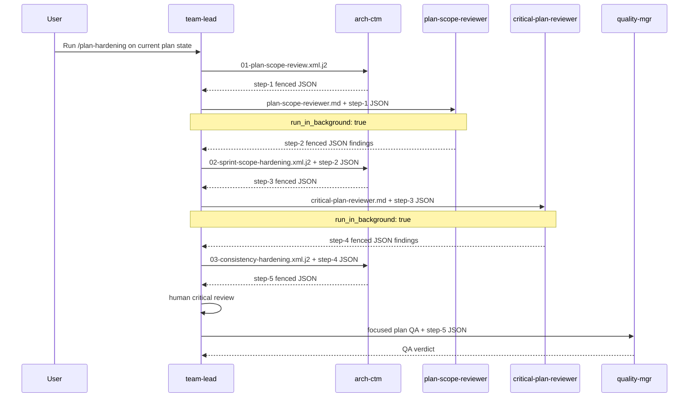
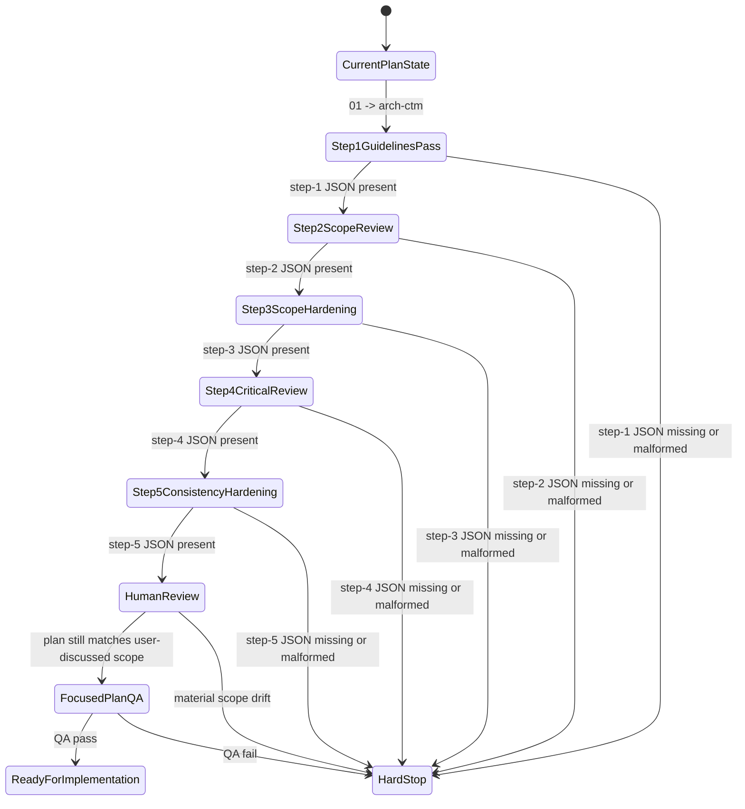

# Plan-Hardening State Machine

`team-lead` should be able to execute this flow by following the numbered
templates and passing the fenced JSON from one step to the next. The plan
details stay in the docs. `team-lead` routes steps and waits for the required
handoff artifact.

## Sequence

## State Machine

## Step Contract

1. `01-plan-scope-review.xml.j2`
   - send to `arch-ctm`
   - purpose: read the guidelines and make sure the plan follows them
   - output: `step-1` fenced JSON

2. `.claude/agents/plan-scope-reviewer.md`
   - launch `plan-scope-reviewer` with Agent tool
   - required input: `step-1` fenced JSON
   - execution: `run_in_background: true`
   - output: `step-2` fenced JSON findings

3. `02-sprint-scope-hardening.xml.j2`
   - send to `arch-ctm`
   - required input: `step-2` fenced JSON
   - output: `step-3` fenced JSON

4. `.claude/agents/critical-plan-reviewer.md`
   - launch `critical-plan-reviewer` with Agent tool
   - required input: `step-3` fenced JSON
   - execution: `run_in_background: true`
   - output: `step-4` fenced JSON findings

5. `03-consistency-hardening.xml.j2`
   - send to `arch-ctm`
   - required input: `step-4` fenced JSON
   - output: `step-5` fenced JSON

6. focused plan QA
   - send to `quality-mgr`
   - required input: `step-5` fenced JSON
   - output: QA verdict
