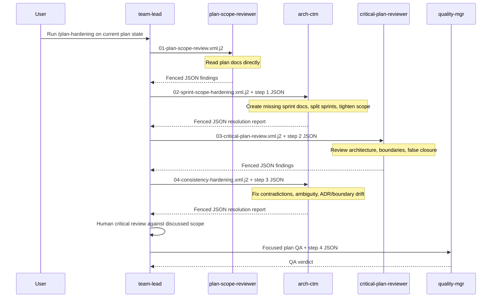
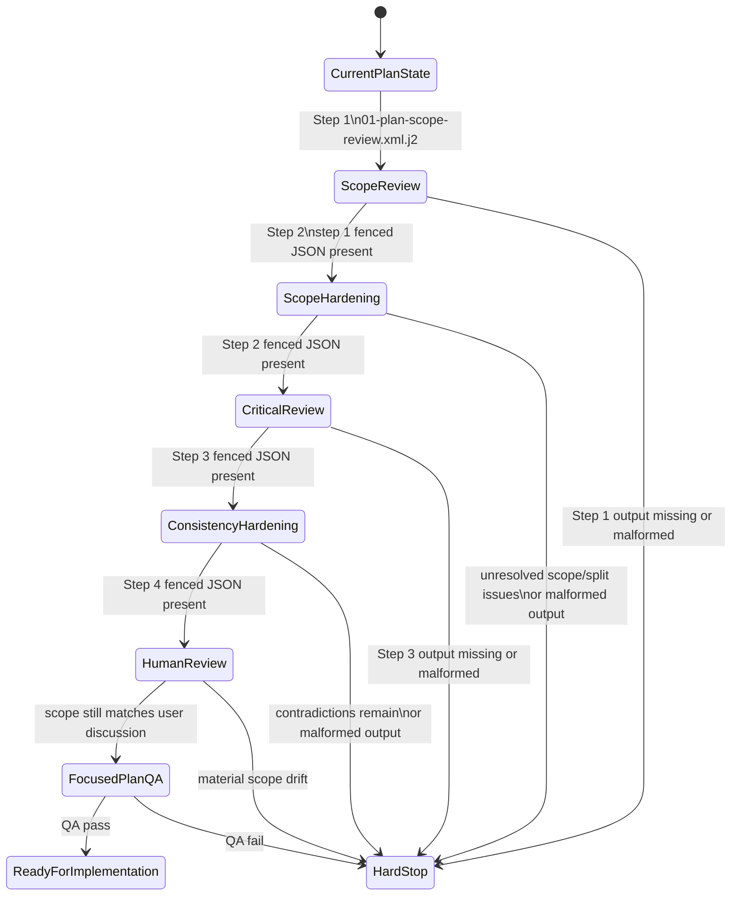

# Plan-Hardening State Machine

This flow must be simple enough for a low-context `team-lead` to execute by
following the numbered templates in order. `team-lead` is a router, not the
planning authority. Plan details must come from the docs and references, not
from `team-lead` paraphrase.

## Routing Table

1. `team-lead -> plan-scope-reviewer`
   - render: `01-plan-scope-review.xml.j2`
   - input authority: current planning docs and references
   - output: fenced JSON findings

2. `team-lead -> arch-ctm`
   - render: `02-sprint-scope-hardening.xml.j2`
   - required input: fenced JSON from step 1
   - output: fenced JSON resolution report

3. `team-lead -> critical-plan-reviewer`
   - render: `03-critical-plan-review.xml.j2`
   - required input: fenced JSON from step 2
   - output: fenced JSON findings

4. `team-lead -> arch-ctm`
   - render: `04-consistency-hardening.xml.j2`
   - required input: fenced JSON from step 3
   - output: fenced JSON resolution report

5. `team-lead -> quality-mgr`
   - render: existing focused plan-QA template
   - required input: fenced JSON from step 4
   - output: QA verdict

## Sequence

## State Machine

## Invariants

- Every step is routed by `team-lead`.
- Every step after step 1 requires the fenced JSON output from the previous
  step.
- Missing or malformed fenced JSON is a hard stop.
- Material scope drift from what the user discussed is a hard stop.
- If `team-lead` must explain the plan for a step to succeed, the docs or
  prompts are not hardened enough.
