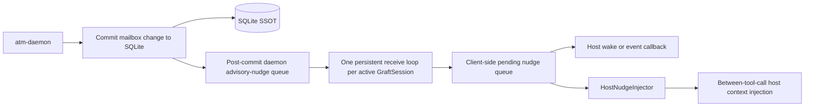

# ATM-Graft Crate Architecture

## 1. Purpose

This document defines the `atm-graft` crate architectural boundary.

It complements the product architecture in
[`../architecture.md`](../architecture.md) and owns only embedded Rust
host-agent integration decisions.

This crate is introduced by the Phase U graft restack line. It is not part of
the pre-daemon workspace.

## 2. Architectural Rules

- `atm-graft` is the embedded crate linked into a Rust host-agent executable.
- the intended production host is a custom agent CLI with `atm-graft` linked
  in-process so ATM nudges can be injected without terminal automation layers.
- `atm-graft` depends on `atm-core` semantic types, request/result contracts,
  config semantics, and error vocabulary.
- `atm-graft` must not depend on `atm-daemon` as a Rust crate; it talks to the
  daemon over the documented same-host protocol only.
- `atm-graft` must not depend on `atm-rusqlite`; direct store access is outside
  its boundary.
- `atm-graft` owns graft-side observability behavior, but it must emit through
  an injected ATM-owned boundary supplied by the embedding host rather than
  requiring a direct public crate dependency.
- `atm-graft` must remain runtime-neutral at its core. Host executables supply
  execution/spawn integration; optional adapters such as `tokio` may be
  provided as additive conveniences.
- `atm-graft` must not own host-specific tool-loop surgery. It exposes a host
  injection bridge, but embedded mode must still perform automatic
  between-tool-call nudge delivery rather than relying on manual polling.
- external terminal automation such as `tmux send-keys` is explicitly out of
  scope as a production graft-delivery mechanism

## 2.1 Implementation Target Snapshot

The current planning target for this design is:
- `integrate/phase-T @ 75d341b`

Current Phase T realities that this architecture must target:
- the daemon/runtime baseline already exists and is no longer speculative
- same-host client/server IPC is already a real product path, not a future
  architectural placeholder
- the remaining work should therefore treat `atm-graft` as a thin
  embedded client extension rather than a second runtime system
- the unresolved work is now mostly about:
  - stabilizing the shared embeddable client surface
  - adding generic session registration and advisory-notification behavior
  - adding the minimal config and crate packaging around that surface

Architectural consequence:
- `atm-graft` planning must target additive follow-on work on top of the
  current IPC/runtime baseline, not a replay of the older Phase Q protocol
  extraction line

## 2.2 Boundary Model

The current runtime uses this split for embedded host-agent integration:

- `atm-core` owns the semantic client protocol contract
- `atm-daemon` owns generic request handling plus generic post-commit nudge
  routing/queue state; it must not own `atm-graft` as a named internal
  subsystem
- `atm-graft` owns the concrete same-host daemon client, graft-session
  lifecycle, and host bridge

Shared command and client-message diagrams live in:
- [`../atm/flow-diagrams.md`](../atm/flow-diagrams.md)

Architectural rules:
- first-party Rust host agents must not invent a parallel transport or
  alternate daemon contract outside the `atm-core` client models consumed by
  `atm-graft`
- all structs, enums, and traits needed by `atm-graft` must live in
  `atm-core`, even when the daemon is the concrete runtime peer
- concrete socket/runtime code may remain outside `atm-core`, but it must bind
  only to `atm-core` protocol and control-state models

## 2.3 Required `atm-core` Surfaces

The required `atm-core` ownership here is intentionally narrow.

Required follow-on ownership in `atm-core`:
- typed embeddable client request / response structs for the retained graft
  operations using the same shared message family as CLI:
  - `send`
  - `read`
  - `ack`
  - generic consumer registration / unregistration
  - advisory nudge subscription and optional drain / fetch
- typed daemon-originated event payloads needed by `atm-graft`, at minimum:
  - `NudgeEvent`
  - registration rejection / shutdown notices if surfaced to the client
- typed config models for `[atm.graft]`
- protocol/interface documentation updates in
  `docs/atm-daemon/protocol-icd.md` for every graft-facing request, response,
  and daemon-originated event boundary added by `U.8` / `U.10`

Boundary correction note:
- any graft-specific protocol or runtime naming from the abandoned earlier line
  is not part of the target architecture
- follow-up refactor work must keep daemon-owned protocol and runtime naming
  generic so `atm-graft` is only an external client crate

Rust boundary rules:
- semantic request / response / event types must not remain raw
  `serde_json::Value` payloads for the published `atm-graft` boundary
- transport correlation ids and ATM mail ids must remain distinct semantic
  types
- do not add a dedicated graft-specific public trait family if the existing
  shared `ClientTransport` and protocol DTOs are sufficient
- stream-oriented traits intended for dynamic dispatch must remain object-safe

## 2.4 Activation And Config Boundary

`atm-graft` is active only inside an ATM-configured project.

Architectural rules:
- `.atm.toml` discovery gates whether graft mode is active at all
- if `.atm.toml` is absent, `atm-graft` remains inert
- runtime identity comes from `ATM_IDENTITY`; graft mode does not add a second
  identity-resolution scheme
- optional graft-specific config remains ATM-owned config semantics rather than
  host-private settings
- the initial graft config surface must stay small:
  - `[atm.graft].enabled = true|false`

Architectural consequence:
- `atm-core` config loading must own the `[atm.graft]` model before
  `atm-graft` activation logic can be implemented cleanly
- the concrete `atm-graft` crate consumes the public `atm_core::load_atm_config`
  helper rather than reparsing `.atm.toml` privately

## 2.5 Graft Session

The active runtime object is `GraftSession`.

Responsibilities:
- connect to the same-host daemon API
- register the current host-agent identity and process context
- run one persistent receive task/thread for daemon-originated nudge events
  while the session is active and keep one dedicated daemon advisory-stream
  socket connection open
- expose daemon-originated nudges to the embedding host executable
- queue received nudges until the embedding host consumes them
- fire a host wake/event callback when a new nudge arrives so inactive hosts
  take action promptly
- drive automatic between-tool-call injection through the host bridge
- shut down cleanly and unregister when appropriate

Architectural rules:
- `U.10` owns only the daemon-side generic registration / queue / fetch /
  drain or advisory-stream runtime needed by `GraftSession`; the concrete
  `GraftSession` lifecycle type itself lands in `U.9`
- the concrete `U.9` surface is:
  - `GraftClient` for the thin daemon-backed same-host client
  - `GraftSession` for the concrete lifecycle runtime
  - `HostNudgeInjector` for automatic between-tool-call host insertion
  - `GraftObservability` for the injected ATM-owned observability boundary
- `GraftSession` registration is automatic by default when graft mode is active
- disconnect / reconnect behavior belongs to `atm-graft`, not to the host
  executable's business logic
- session lifecycle failures remain typed and observable; they must not collapse
  into silent disabled behavior after activation succeeded
- embedded mode must keep exactly one active receive task/thread per active
  session; omitting the receive loop defeats the purpose of `atm-graft`
- the host supplies the execution model for that receive loop, but `atm-graft`
  must require the loop to exist
- the production receive loop must block on the dedicated daemon
  advisory-stream connection; a periodic poll/drain loop is not the production
  `atm-graft` design

Queue-ownership rule:
- bounded pending-nudge state belongs in the daemon
- `atm-graft` may keep only transient fetched state needed to hand nudges to
  the embedding host, plus the minimal pending client-side queue needed until
  the host consumes the nudges
- any daemon-queue overflow/backpressure behavior must emit structured
  observability and must not affect durable ATM mail truth

State-model rule:
- the runtime must keep the lifecycle explicit at least across:
  - inactive
  - connecting
  - registered
  - disconnected / retrying
  - closed

## 2.6 Nudge Delivery Model

Nudges originate from the daemon, not from local shell hooks.

Concrete runtime shape:

Architectural rules:
- the daemon emits one internal post-send runtime event after authoritative
  message commit
- daemon-owned notifier logic may transform that event into one or more nudge
  payloads for matching registered consumers; `atm-graft` is one such
  external consumer
- the host-facing payload is structured and contains at least:
  - `from`
  - `message`
- `U.10` adds the daemon-side queue ownership plus typed drain/fetch or
  subscription control; `U.9` adds the embedded receive loop that consumes
  that surface automatically
- nudge receipt and injection must be automatic in embedded mode; manual
  polling alone is insufficient for `atm-graft`
- delivered nudge order must preserve daemon queue order from the perspective
  of the embedding agent loop
- the open receive connection must remain active even while the host is idle so
  nudges are observed promptly
- the live receive connection is a dedicated daemon advisory-stream socket
  owned by the active `GraftSession`
- new nudges must enqueue client-side until host consumption and must trigger a
  host wake/event signal carrying enough information for the host to force
  follow-on action
- nudges are advisory delivery signals, not durable mail truth; authoritative
  message state remains behind daemon-backed `read` calls

Non-production companion rule:
- the same pending nudge state may also be exposed through a daemon poll /
  drain request on the `atm` CLI surface for debugging, migration, or
  non-embedded environments
- that CLI path is not a substitute for embedded-mode automatic injection and
  must not be treated as production-complete `atm-graft` behavior

## 2.7 Client API Boundary

`atm-graft` should expose a deliberately small public surface.

Required public capability groups:
- graft-session lifecycle
- same-host daemon client calls for `send`, `read`, and `ack`
- host-facing automatic nudge injection integration

Lean contract shape:
- `GraftClient` reuses the shared `atm-core` transport and protocol DTOs for
  unary `send` / `read` / `ack`
- `GraftSession` owns registration, the persistent receive loop, the minimal
  client-side pending queue, and host wake/injection behavior
- any optional drain/fetch helpers exist only as thin wrappers over the same
  shared daemon API surface; they do not become a second public runtime model

Boundary rule:
- a hook-facing command that prints insertion-ready nudge text is an `atm`
  command built on the same daemon API, not a CLI owned by the `atm-graft`
  crate itself

Architectural rules:
- `read` uses the daemon API rather than direct SQLite access
- `send` and `ack` use the same daemon-backed semantic contract as `atm`
- any optional runtime heartbeat or activity reporting must also use the daemon
  API instead of side channels

## 2.8 Observability Boundary

`atm-graft` owns its own runtime/client observability.

Architectural rules:
- graft-side events emit through the embedding host's injected observability
  boundary
- graft-side events remain separate from daemon-owned runtime and transport
  events
- the embedding host provides the concrete observability adapter; `atm-graft`
  consumes an injected ATM-owned trait surface rather than a direct public
  dependency
- registration, reconnect, queue-overflow, and daemon-unavailable paths must
  keep typed error identity with recovery guidance

## 2.9 Boundary Verification Anchors

`arch-qa` and `req-qa` should reject the graft line if any of the following are
not true:

- `atm-graft` has no Rust dependency on `atm-daemon`
- `atm-graft` has no direct SQLite or inbox-JSONL access
- the daemon remains the sole owner of pending-nudge queue state
- the hook/poll nudge path uses the same daemon API contract as the embedded
  session path
- embedded mode includes one required receive task/thread and automatic
  between-tool-call nudge injection
- embedded mode keeps one persistent daemon connection for nudges and signals
  the host when new nudges arrive while it is idle
- production graft delivery does not rely on `tmux send-keys` or equivalent
  external terminal automation
- the public `atm-graft` API remains limited to the documented thin embedded
  client surface rather than mirroring the full CLI
- the concrete crate exports `GraftClient`, `GraftSession`,
  `HostNudgeInjector`, and `GraftObservability`
