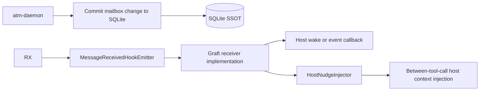

# ATM-Graft Crate Architecture

## 1. Purpose

This document defines the `atm-graft` crate architectural boundary.

It complements the product architecture in
[`../architecture.md`](../architecture.md) and owns only embedded Rust
host-agent integration decisions.

This crate is introduced by the Phase U graft restack line. It is not part of
the pre-daemon workspace.

## 2. Architectural Rules

- `atm-graft` is the embedded crate linked into a Rust host-agent executable.
- the intended production host is a custom agent CLI with `atm-graft` linked
  in-process so ATM nudges can be injected without terminal automation layers.
- `atm-graft` depends on `atm-core` semantic types, request/result contracts,
  config semantics, and error vocabulary.
- `atm-graft` may depend on the shared thin-client same-host bootstrap seam
  owned by `atm-daemon-client` for canonical endpoint resolution,
  daemon-binary resolution, probe, and supervised auto-start convenience, but
  it must not depend on `atm-daemon-bootstrap` or on runtime/storage
  composition crates to obtain that behavior.
- `atm-graft` must not depend on `atm-daemon` as a Rust crate; it talks to the
  daemon over the documented same-host protocol only.
- `atm-graft` must not depend on `atm-rusqlite`; direct store access is outside
  its boundary.
- `atm-graft` owns graft-side observability behavior, but it must emit through
  an injected ATM-owned boundary supplied by the embedding host rather than
  requiring a direct public crate dependency.
- `atm-graft` must remain runtime-neutral at its core. Host executables supply
  execution/spawn integration; optional adapters such as `tokio` may be
  provided as additive conveniences.
- `atm-graft` must not own host-specific tool-loop surgery. It exposes a host
  injection bridge, but embedded mode must still perform automatic
  between-tool-call nudge delivery rather than relying on manual polling.
- external terminal automation such as `tmux send-keys` is explicitly out of
  scope as a production graft-delivery mechanism

## 2.1 Implementation Target Snapshot

The current planning target for this design is:
- `integrate/phase-T @ 75d341b`

Current Phase T realities that this architecture must target:
- the daemon/runtime baseline already exists and is no longer speculative
- same-host client/server IPC is already a real product path, not a future
  architectural placeholder
- the remaining work should therefore treat `atm-graft` as a thin
  embedded client extension rather than a second runtime system
- the unresolved work is now mostly about:
  - stabilizing the shared embeddable client surface
  - tightening the thin receiver handoff so receiver-specific state stays out
    of shared daemon/core contracts
  - adding the minimal config and crate packaging around that surface

Architectural consequence:
- `atm-graft` planning must target additive follow-on work on top of the
  current IPC/runtime baseline, not a replay of the older Phase Q protocol
  extraction line

## 2.2 Boundary Model

The current runtime uses this split for embedded host-agent integration:

- `atm-core` owns the semantic client protocol contract
- `atm-daemon` owns generic request handling plus post-commit emission
  dispatch only; it must not own graft-private receiver buffering, pending
  queue mechanics, or `atm-graft` as a named internal subsystem
- `atm-graft` owns the concrete same-host daemon client, graft-session
  lifecycle, host bridge, and any receiver-private buffering or pending nudge
  queue state

Shared command and client-message diagrams live in:
- [`../atm/flow-diagrams.md`](../atm/flow-diagrams.md)

Architectural rules:
- first-party Rust host agents must not invent a parallel transport or
  alternate daemon contract outside the `atm-core` client models consumed by
  `atm-graft`
- first-party Rust host agents may expose a standard convenience `connect()`
  path that resolves ATM environment/config inputs and starts the daemon when
  launch conditions are met, but that path must remain a thin-client wrapper
  over the shared bootstrap seam rather than a second composition root
- all structs, enums, and traits needed by `atm-graft` must live in
  `atm-core` only when they represent shared ATM semantics rather than
  receiver-private implementation detail
- concrete socket/runtime code may remain outside `atm-core`, but it must bind
  only to accepted shared ATM protocol models and must not force
  receiver-private session/stream state back into `atm-core`

## 2.3 Required `atm-core` Surfaces

The required `atm-core` ownership here is intentionally narrow.

Required follow-on ownership in `atm-core`:
- typed embeddable client request / response structs for the retained graft
  operations using the same shared message family as CLI:
  - `send`
  - `read`
  - no additional graft-private packet family unless it is proven to be shared
    ATM semantics
- typed daemon-originated event payloads needed by `atm-graft`, at minimum:
  - post-send hook event payloads sufficient for host handoff
  - activation rejection / shutdown notices if surfaced to the client
- typed config models for `[atm.graft]`
- HTTP/OpenAPI interface documentation updates in
  `docs/atm-daemon/http-api.md` for every graft-facing request, response, and
  daemon-originated event boundary added by `U.8` / `U.10`

Boundary correction note:
- any graft-specific protocol or runtime naming from the abandoned earlier line
  is not part of the target architecture
- follow-up refactor work must keep daemon-owned protocol and runtime naming
  generic so `atm-graft` is only an external client crate
- version skew between `atm-graft` and the primary `atm` install is acceptable
  as long as both sides remain compatible with the documented same-host RPC
  surface; `atm-graft` must not rely on lockstep crate-version equality as an
  architectural requirement

## 2.4 Python Host Binding (AI.18–AI.21)

AI.18 may package the existing graft surface with PyO3/Maturin. It owns only
typed Rust-to-Python translation: `AgentAddress`, canonical nudge projection,
graft lifecycle, and daemon API results. It does not own a Python transport,
storage adapter, address parser, or post-write behavior.

AI.17 maps client-neutral `ATM_CHAT_ID` to ADR-037 `ChatId` before the shared caller
address is built. AI.19 maps the canonical nudge source address to a Hermes
`atm:` chat and injects the body after the daemon's post-write event. Neither
step re-renders and reparses an address or changes the persisted message.

Rust boundary rules:
- semantic request / response / event types must not remain raw
  `serde_json::Value` payloads for the published `atm-graft` boundary
- transport correlation ids and ATM mail ids must remain distinct semantic
  types
- do not add a dedicated graft-specific public trait family when the shared
  HTTP client contract and application DTOs are sufficient
- stream-oriented traits intended for dynamic dispatch must remain object-safe

## 2.4 Activation And Config Boundary

`atm-graft` receiver activation is identity-driven, not project-config-driven.

Architectural rules:
- a valid caller-provided `ATM_IDENTITY` and `ATM_TEAM` envelope activates the
  receiver; a clean activation return means the receiver is listening and its
  endpoint record is published
- `.atm.toml` is optional ATM-owned configuration. Its absence must not leave
  a graft receiver inert or silently suppress activation
- runtime identity comes from `ATM_IDENTITY`; graft mode does not add a second
  identity-resolution scheme
- if graft mode is active and identity/team resolution succeeds, the standard
  convenience connection path may resolve the canonical same-host daemon
  endpoint and attempt supervised daemon auto-start; the presence of
  `.atm.toml`, `ATM_IDENTITY`, and `ATM_TEAM` is a valid launch precondition,
  not a reason to forbid daemon startup
- optional graft-specific config remains ATM-owned config semantics rather than
  host-private settings
- a legacy `[atm.graft].enabled` value may remain parseable for compatibility,
  but it is not an activation gate

Architectural consequence:
- `atm-core` config loading remains the source of optional ATM configuration;
  malformed configuration is an activation error, while absent configuration
  uses built-in defaults
- the concrete `atm-graft` crate consumes the public `atm_core::load_atm_config`
  helper rather than reparsing `.atm.toml` privately
- the standard convenience path must collect those ATM-owned inputs and pass
  them into a shared thin-client bootstrap helper seam rather than binding
  `atm-graft` directly to `atm-daemon-bootstrap`, `atm-runtime`, or concrete
  storage backends

## 2.5 Graft Session

The active runtime object is `GraftSession`.

Responsibilities:
- connect to the same-host daemon API
- activate the current host-agent receiver context
- expose daemon-originated nudges to the embedding host executable
- retain any temporary receiver-local state needed until the embedding host
  consumes the event
- fire a host wake/event callback when a new nudge arrives so inactive hosts
  take action promptly
- drive automatic between-tool-call injection through the host bridge
- shut down cleanly when appropriate

Architectural rules:
- the concrete `U.9` surface is:
  - `GraftClient` for the thin daemon-backed same-host client
  - `GraftSession` for the concrete lifecycle runtime
  - `HostNudgeInjector` for automatic between-tool-call host insertion
  - `GraftObservability` for the injected ATM-owned observability boundary
- `GraftSession` activation is automatic by default when graft mode is active
- disconnect / reconnect behavior belongs to `atm-graft`, not to the host
  executable's business logic
- session lifecycle failures remain typed and observable; they must not collapse
  into silent disabled behavior after activation succeeded
- embedded mode must automatically surface post-send events to the host's
  between-tool-call insertion seam; passive manual polling alone is not
  accepted production behavior
- the host supplies the execution model for any internal receive task, callback
  pump, or equivalent mechanism, but that choice stays private to `atm-graft`
- the accepted architecture does not require a dedicated shared daemon
  stream connection or shared daemon session registration protocol

Receiver-state rule:
- if `atm-graft` keeps active/inactive status, wake signals, or temporary
  buffering, that state belongs inside `atm-graft`
- shared daemon/core contracts must not model that receiver-private state as
  public packet families, shared DTOs, or dispatcher methods
- any receiver-local buffering/backpressure behavior must emit structured
  observability and must not affect durable ATM mail truth

State-model rule:
- if the runtime exposes lifecycle publicly, it must stay minimal and
  implementation-local rather than forcing a shared daemon session model

## 2.6 Nudge Delivery Model

Nudges originate from the daemon, not from local shell hooks.

Concrete runtime shape:

Architectural rules:
- the daemon emits one internal post-send runtime event after authoritative
  message commit
- when the recipient uses the graft capability, the graft receiver
  implementation is responsible for handing that event to the host injection
  seam
- the concrete graft-backed sink is `GraftReceiveHook`; it is one receiver sink
  behind the shared post-send boundary, not a special daemon-owned runtime
- the host-facing payload is structured and contains at least:
  - `from`
  - `message_id`
- acknowledge-family nudges use the compact built-in envelope:
  - `<atm kind="ack" from="..." message-id="..."/>`
  - `<atm kind="ack" from="..." message-id="..." task-id="..."/>`
- task-bearing delivery or acknowledge nudges may carry `task_id`; delivery
  nudges may additionally carry `description`
- the accepted same-host host-nudge race closure uses deterministic
  receiver-readiness signaling in the test harness:
  - tests wait on an explicit ready latch after the receiver listener binds
  - production and test host-nudge injection share the same bounded delivery
    deadline
  - the accepted line must not reintroduce a special shorter `#[cfg(test)]`
    timeout as a substitute for explicit startup readiness
- helper-thread fallback is allowed only for operations that may block inside a
  host callback or local-socket wake call and cannot be force-cancelled by the
  crate boundary itself
- those helper-thread fallbacks must therefore bound residual resource growth
  explicitly instead of pretending cancellation exists:
  - host nudge injection is capped at `8` in-flight detached helpers per
    active `GraftSession`
  - listener wake connect is capped at `2` in-flight detached helpers per
    process
  - once the cap is reached, `atm-graft` must fail the next request with a
    typed ATM error and emit `tracing::warn!` with
    `subsystem` / `action` / `outcome` fields so repeated hangs are observable
    without custom host instrumentation
- nudge receipt and injection must be automatic in embedded mode; manual
  polling alone is insufficient for `atm-graft`
- the exact transport or callback mechanism used for that handoff is private to
  the graft implementation and is not part of the shared daemon packet
  registry
- any temporary receiver-local buffering must stay private to `atm-graft`
- nudges are advisory delivery signals, not durable mail truth; authoritative
  message state remains behind daemon-backed `read` calls

Non-production companion rule:
- any debugging or migration helper that renders graft-directed nudges on the
  `atm` CLI surface is non-production support only
- that helper path must not be treated as production-complete `atm-graft`
  behavior or allowed to reintroduce shared daemon session/stream protocol
  families

## 2.7 Client API Boundary

`atm-graft` should expose a deliberately small public surface.

Required public capability groups:
- graft-session lifecycle
- same-host daemon client calls for `send` and `read`
- host-facing automatic nudge injection integration

Lean contract shape:
- `GraftClient` reuses the shared `atm-core` transport and protocol DTOs for
  unary `send` / `read`
- `GraftSession` owns only receiver-local activation and host wake/injection
  behavior
- receiver-private runtime details stay inside `atm-graft`; they do not become
  shared daemon packet families or a second public runtime model

Boundary rule:
- a hook-facing command that prints insertion-ready nudge text is an `atm`
  command built on the same daemon API, not a CLI owned by the `atm-graft`
  crate itself

Architectural rules:
- `read` uses the daemon API rather than direct SQLite access
- `send` uses the same daemon-backed semantic contract as `atm`; `atm ack`
  is a CLI convenience command that emits a canonical linked write
- any optional runtime heartbeat or activity reporting must also use the daemon
  API instead of side channels

## 2.8 Observability Boundary

`atm-graft` owns its own runtime/client observability.

Architectural rules:
- graft-side events emit through the embedding host's injected observability
  boundary
- graft-side events remain separate from daemon-owned runtime and transport
  events
- the embedding host provides the concrete observability adapter; `atm-graft`
  consumes an injected ATM-owned trait surface rather than a direct public
  dependency
- activation, reconnect, receiver-buffering, and daemon-unavailable paths must
  keep typed error identity with recovery guidance

## 2.9 Boundary Verification Anchors

`arch-qa` and `req-qa` should reject the graft line if any of the following are
not true:

- `atm-graft` has no Rust dependency on `atm-daemon`
- `atm-graft` has no direct SQLite or inbox-JSONL access
- any receiver-private buffering or idle wakeup state stays inside
  `atm-graft`; the daemon owns post-send emission, not graft-private pending
  queue mechanics
- the hook/push nudge path uses the same documented post-send event family as
  any embedded receive path and must not require a separate advisory
  register/fetch/drain surface
- embedded mode includes one required receive task/thread and automatic
  between-tool-call nudge injection
- embedded mode may use request/response wakeups or another thin
  receiver-private mechanism; the architecture must not require one persistent
  shared daemon connection for nudge delivery
- production graft delivery does not rely on `tmux send-keys` or equivalent
  external terminal automation
- the public `atm-graft` API remains limited to the documented thin embedded
  client surface rather than mirroring the full CLI
- the concrete crate exports `GraftClient`, `GraftSession`,
  `HostNudgeInjector`, and `GraftObservability`
