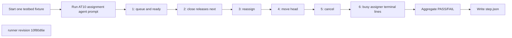
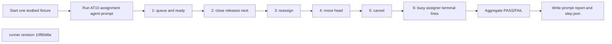

## What this test proves
Inside the colima testbed, a real agent executes prompt AT10 and observes assignment transitions only through public ATM CLI JSON. Queue, ready, close, reassign, move, cancel, and busy-assigner behavior must match the task protocol while pending-ack remains untouched.

## Flow

```mermaid
flowchart LR
  setup[Start testbed container for colima-assignment]
  case1[1: three_assignments_show_queued_1_2_3_then]
  case2[2: pending_ack_header_stays_zero_across_ass]
  case3[3: close_shows_ready_for_next_task_within_o]
  case4[4: reassign_shows_closed_reassigned_to_old_]
  case5[5: move_to_head_while_idle_shows_ready_next]
  case6[6: cancel_shows_closed_cancelled_to_assigne]
  case7[7: busy_assigner_receives_started_and_compl]
  verdict[Aggregate PASS/FAIL]
  evidence[Write step.json]
  setup --> case1
  case1 --> case2
  case2 --> case3
  case3 --> case4
  case4 --> case5
  case5 --> case6
  case6 --> case7
  case7 --> verdict
  verdict --> evidence
  note[runner revision 5df9c2f0]:::revision
```

## Steps
| step | action | observable | evidence |
| --- | --- | --- | --- |
| 1 | Tell the agent to assign three tasks | task events show queued positions 1–3, one ready, and pending-ack zero | `prompt-AT10.json` and `step.json` cases |
| 2 | Start and close the ready task | bounded task-list/events polling shows the next task ready | `prompt-AT10.json` and `step.json` cases |
| 3 | Reassign a queued task | public mail/events show reassigned to the old assignee and queued to the new | `prompt-AT10.json` and `step.json` cases |
| 4 | Move an idle assignee's queued task to head | task events show exactly one new ready transition | `prompt-AT10.json` and `step.json` cases |
| 5 | Cancel a queued task | public mail/events show the cancelled terminal outcome | `prompt-AT10.json` and `step.json` cases |
| 6 | Start and complete while the assigner is busy | assigner mail/history shows started before completed | `prompt-AT10.json` and `step.json` cases |

## Evidence layout
This procedure is one step of a colima integration run. The agent's unedited `prompt-report-1` JSON is retained beside `step.json`; `scripts/integration/render_colima.py` renders the panel and aggregate. Historical payloads remain byte-identical and render through the same path.

## Changes
The revision sections below list every runner revision that produced committed evidence, newest first. A run whose source revision is not an ancestor of any listed revision links to the revision in effect on its run date and is marked inferred.

## Revision 10f80d6e (2026-09-13)
The host-side assignment simulator was deleted. The thin driver starts one fixture and asks its real agent to execute AT10; every assertion is public ATM CLI output retained in `prompt-report-1`.

## Steps
| step | action | observable | evidence |
| --- | --- | --- | --- |
| 1 | Tell the agent to assign three tasks | task events show queued positions 1–3, one ready, and pending-ack zero | `prompt-AT10.json` and `step.json` cases |
| 2 | Start and close the ready task | bounded task-list/events polling shows the next task ready | `prompt-AT10.json` and `step.json` cases |
| 3 | Reassign a queued task | public mail/events show reassigned to the old assignee and queued to the new | `prompt-AT10.json` and `step.json` cases |
| 4 | Move an idle assignee's queued task to head | task events show exactly one new ready transition | `prompt-AT10.json` and `step.json` cases |
| 5 | Cancel a queued task | public mail/events show the cancelled terminal outcome | `prompt-AT10.json` and `step.json` cases |
| 6 | Start and complete while the assigner is busy | assigner mail/history shows started before completed | `prompt-AT10.json` and `step.json` cases |

## Revision 5df9c2f0 (2026-09-13)
The runner change `fix(bb): correct evidence provenance and roster scope` is the source for this revision's procedure order.

## Steps
| step | action | observable | evidence |
| --- | --- | --- | --- |
| 1 | `three_assignments_show_queued_1_2_3_then_one_ready`: assign three tasks to an idle assignee | queued lines numbered 1, 2, 3 then one ready line; recorded PASS or FAIL at revision `5df9c2f0` | `step.json` cases |
| 2 | `pending_ack_header_stays_zero_across_assignments`: read the assignee's mailbox header after each assignment | pending-ack stays 0; recorded PASS or FAIL at revision `5df9c2f0` | `step.json` cases |
| 3 | `close_shows_ready_for_next_task_within_one_pass`: close the active task | the next task's ready line appears within one pass; recorded PASS or FAIL at revision `5df9c2f0` | `step.json` cases |
| 4 | `reassign_shows_closed_reassigned_to_old_and_queued_to_new`: reassign a queued task | old assignee sees closed (reassigned), new assignee sees queued; recorded PASS or FAIL at revision `5df9c2f0` | `step.json` cases |
| 5 | `move_to_head_while_idle_shows_ready_next_pass_and_no_extra_line`: move a queued task to the head while idle | one ready line on the next pass and nothing else; recorded PASS or FAIL at revision `5df9c2f0` | `step.json` cases |
| 6 | `cancel_shows_closed_cancelled_to_assignee`: cancel a queued task | the assignee sees closed (cancelled); recorded PASS or FAIL at revision `5df9c2f0` | `step.json` cases |
| 7 | `busy_assigner_receives_started_and_complete_at_write_time`: assignee starts and completes while the assigner is busy | started and complete lines are in the assigner's mail at write time; recorded PASS or FAIL at revision `5df9c2f0` | `step.json` cases |

## Revision 0cbc4adc (2026-09-12)
The runner change `test: add BB5 colima assignment scenarios` is the source for this revision's procedure order.

## Steps
| step | action | observable | evidence |
| --- | --- | --- | --- |
| 1 | `three_assignments_show_queued_1_2_3_then_one_ready`: assign three tasks to an idle assignee | queued lines numbered 1, 2, 3 then one ready line; recorded PASS or FAIL at revision `0cbc4adc` | `step.json` cases |
| 2 | `pending_ack_header_stays_zero_across_assignments`: read the assignee's mailbox header after each assignment | pending-ack stays 0; recorded PASS or FAIL at revision `0cbc4adc` | `step.json` cases |
| 3 | `close_shows_ready_for_next_task_within_one_pass`: close the active task | the next task's ready line appears within one pass; recorded PASS or FAIL at revision `0cbc4adc` | `step.json` cases |
| 4 | `reassign_shows_closed_reassigned_to_old_and_queued_to_new`: reassign a queued task | old assignee sees closed (reassigned), new assignee sees queued; recorded PASS or FAIL at revision `0cbc4adc` | `step.json` cases |
| 5 | `move_to_head_while_idle_shows_ready_next_pass_and_no_extra_line`: move a queued task to the head while idle | one ready line on the next pass and nothing else; recorded PASS or FAIL at revision `0cbc4adc` | `step.json` cases |
| 6 | `cancel_shows_closed_cancelled_to_assignee`: cancel a queued task | the assignee sees closed (cancelled); recorded PASS or FAIL at revision `0cbc4adc` | `step.json` cases |
| 7 | `busy_assigner_receives_started_and_complete_at_write_time`: assignee starts and completes while the assigner is busy | started and complete lines are in the assigner's mail at write time; recorded PASS or FAIL at revision `0cbc4adc` | `step.json` cases |
