## What this test proves
Inside the colima testbed, every assignment transition (queue, ready, close, reassign, move to head, cancel, busy assigner) produces exactly the terminal lines the task protocol promises, at write time, with the pending-ack header untouched.

## Flow

```mermaid
flowchart LR
  setup[Start testbed container for colima-assignment]
  case1[1: three_assignments_show_queued_1_2_3_then]
  case2[2: pending_ack_header_stays_zero_across_ass]
  case3[3: close_shows_ready_for_next_task_within_o]
  case4[4: reassign_shows_closed_reassigned_to_old_]
  case5[5: move_to_head_while_idle_shows_ready_next]
  case6[6: cancel_shows_closed_cancelled_to_assigne]
  case7[7: busy_assigner_receives_started_and_compl]
  verdict[Aggregate PASS/FAIL]
  evidence[Write step.json]
  setup --> case1
  case1 --> case2
  case2 --> case3
  case3 --> case4
  case4 --> case5
  case5 --> case6
  case6 --> case7
  case7 --> verdict
  verdict --> evidence
  note[runner revision 5df9c2f0]:::revision
```

## Steps
| step | action | observable | evidence |
| --- | --- | --- | --- |
| 1 | `three_assignments_show_queued_1_2_3_then_one_ready`: assign three tasks to an idle assignee | queued lines numbered 1, 2, 3 then one ready line; recorded PASS or FAIL at revision `5df9c2f0` | `step.json` cases |
| 2 | `pending_ack_header_stays_zero_across_assignments`: read the assignee's mailbox header after each assignment | pending-ack stays 0; recorded PASS or FAIL at revision `5df9c2f0` | `step.json` cases |
| 3 | `close_shows_ready_for_next_task_within_one_pass`: close the active task | the next task's ready line appears within one pass; recorded PASS or FAIL at revision `5df9c2f0` | `step.json` cases |
| 4 | `reassign_shows_closed_reassigned_to_old_and_queued_to_new`: reassign a queued task | old assignee sees closed (reassigned), new assignee sees queued; recorded PASS or FAIL at revision `5df9c2f0` | `step.json` cases |
| 5 | `move_to_head_while_idle_shows_ready_next_pass_and_no_extra_line`: move a queued task to the head while idle | one ready line on the next pass and nothing else; recorded PASS or FAIL at revision `5df9c2f0` | `step.json` cases |
| 6 | `cancel_shows_closed_cancelled_to_assignee`: cancel a queued task | the assignee sees closed (cancelled); recorded PASS or FAIL at revision `5df9c2f0` | `step.json` cases |
| 7 | `busy_assigner_receives_started_and_complete_at_write_time`: assignee starts and completes while the assigner is busy | started and complete lines are in the assigner's mail at write time; recorded PASS or FAIL at revision `5df9c2f0` | `step.json` cases |

## Evidence layout
This procedure is one step of a colima integration run. The runner's payload is kept byte-for-byte as `steps/NN-assignment/step.json` under `site/reports/integration/colima/<run>/`; the step's `panel.xhtml` and the run's `index.html`, `integration.json` and envelope are rendered from it by `scripts/integration/render_colima.py`. Historical runs made before the integration layout existed were moved into it unchanged and are rendered by the same code.

## Changes
The revision sections below list every runner revision that produced committed evidence, newest first. A run whose source revision is not an ancestor of any listed revision links to the revision in effect on its run date and is marked inferred.

## Revision 5df9c2f0 (2026-09-13)
The runner change `fix(bb): correct evidence provenance and roster scope` is the source for this revision's procedure order.

## Steps
| step | action | observable | evidence |
| --- | --- | --- | --- |
| 1 | `three_assignments_show_queued_1_2_3_then_one_ready`: assign three tasks to an idle assignee | queued lines numbered 1, 2, 3 then one ready line; recorded PASS or FAIL at revision `5df9c2f0` | `step.json` cases |
| 2 | `pending_ack_header_stays_zero_across_assignments`: read the assignee's mailbox header after each assignment | pending-ack stays 0; recorded PASS or FAIL at revision `5df9c2f0` | `step.json` cases |
| 3 | `close_shows_ready_for_next_task_within_one_pass`: close the active task | the next task's ready line appears within one pass; recorded PASS or FAIL at revision `5df9c2f0` | `step.json` cases |
| 4 | `reassign_shows_closed_reassigned_to_old_and_queued_to_new`: reassign a queued task | old assignee sees closed (reassigned), new assignee sees queued; recorded PASS or FAIL at revision `5df9c2f0` | `step.json` cases |
| 5 | `move_to_head_while_idle_shows_ready_next_pass_and_no_extra_line`: move a queued task to the head while idle | one ready line on the next pass and nothing else; recorded PASS or FAIL at revision `5df9c2f0` | `step.json` cases |
| 6 | `cancel_shows_closed_cancelled_to_assignee`: cancel a queued task | the assignee sees closed (cancelled); recorded PASS or FAIL at revision `5df9c2f0` | `step.json` cases |
| 7 | `busy_assigner_receives_started_and_complete_at_write_time`: assignee starts and completes while the assigner is busy | started and complete lines are in the assigner's mail at write time; recorded PASS or FAIL at revision `5df9c2f0` | `step.json` cases |

## Revision 0cbc4adc (2026-09-12)
The runner change `test: add BB5 colima assignment scenarios` is the source for this revision's procedure order.

## Steps
| step | action | observable | evidence |
| --- | --- | --- | --- |
| 1 | `three_assignments_show_queued_1_2_3_then_one_ready`: assign three tasks to an idle assignee | queued lines numbered 1, 2, 3 then one ready line; recorded PASS or FAIL at revision `0cbc4adc` | `step.json` cases |
| 2 | `pending_ack_header_stays_zero_across_assignments`: read the assignee's mailbox header after each assignment | pending-ack stays 0; recorded PASS or FAIL at revision `0cbc4adc` | `step.json` cases |
| 3 | `close_shows_ready_for_next_task_within_one_pass`: close the active task | the next task's ready line appears within one pass; recorded PASS or FAIL at revision `0cbc4adc` | `step.json` cases |
| 4 | `reassign_shows_closed_reassigned_to_old_and_queued_to_new`: reassign a queued task | old assignee sees closed (reassigned), new assignee sees queued; recorded PASS or FAIL at revision `0cbc4adc` | `step.json` cases |
| 5 | `move_to_head_while_idle_shows_ready_next_pass_and_no_extra_line`: move a queued task to the head while idle | one ready line on the next pass and nothing else; recorded PASS or FAIL at revision `0cbc4adc` | `step.json` cases |
| 6 | `cancel_shows_closed_cancelled_to_assignee`: cancel a queued task | the assignee sees closed (cancelled); recorded PASS or FAIL at revision `0cbc4adc` | `step.json` cases |
| 7 | `busy_assigner_receives_started_and_complete_at_write_time`: assignee starts and completes while the assigner is busy | started and complete lines are in the assigner's mail at write time; recorded PASS or FAIL at revision `0cbc4adc` | `step.json` cases |
