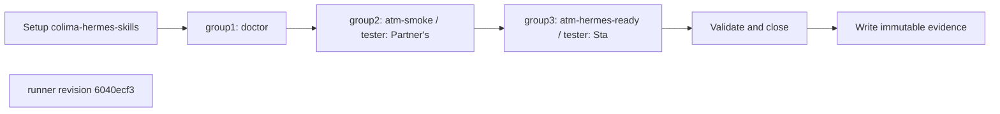

## What this test proves
The Colima lane consumes the testbed's seven skill reports, retains each numbered step in arrival order, and adds local doctor, transport, and testbed-reference preflight rows. The report cases are the evidence index for every skill assertion.

## Flow

## Steps
| step | action | observable | evidence |
| --- | --- | --- | --- |
| 1 | Execute `doctor` | The named check reports PASS or FAIL at revision `6040ecf3` | `colima-hermes-skills.json` cases |
| 2 | Execute `advertised host` | The named check reports PASS or FAIL at revision `6040ecf3` | `colima-hermes-skills.json` cases |
| 3 | Execute `herdr transport (atm doctor, fixture daemon)` | The named check reports PASS or FAIL at revision `6040ecf3` | `colima-hermes-skills.json` cases |
| 4 | Execute `atm-setup-environment / tester: Start line` | The named check reports PASS or FAIL at revision `6040ecf3` | `colima-hermes-skills.json` cases |
| 5 | Execute `atm-setup-environment / tester: Daemon answers` | The named check reports PASS or FAIL at revision `6040ecf3` | `colima-hermes-skills.json` cases |
| 6 | Execute `atm-setup-environment / tester: Roster complete` | The named check reports PASS or FAIL at revision `6040ecf3` | `colima-hermes-skills.json` cases |
| 7 | Execute `atm-setup-environment / tester: Doctor passes` | The named check reports PASS or FAIL at revision `6040ecf3` | `colima-hermes-skills.json` cases |
| 8 | Execute `atm-setup-environment / tester: Self round trip` | The named check reports PASS or FAIL at revision `6040ecf3` | `colima-hermes-skills.json` cases |
| 9 | Execute `atm-setup-environment / tester: Cross-host peer` | The named check reports PASS or FAIL at revision `6040ecf3` | `colima-hermes-skills.json` cases |
| 10 | Execute `atm-setup-environment / hermes: Start line` | The named check reports PASS or FAIL at revision `6040ecf3` | `colima-hermes-skills.json` cases |
| 11 | Execute `atm-setup-environment / hermes: Daemon answers` | The named check reports PASS or FAIL at revision `6040ecf3` | `colima-hermes-skills.json` cases |
| 12 | Execute `atm-setup-environment / hermes: Roster complete` | The named check reports PASS or FAIL at revision `6040ecf3` | `colima-hermes-skills.json` cases |
| 13 | Execute `atm-setup-environment / hermes: Doctor passes` | The named check reports PASS or FAIL at revision `6040ecf3` | `colima-hermes-skills.json` cases |
| 14 | Execute `atm-setup-environment / hermes: Self round trip` | The named check reports PASS or FAIL at revision `6040ecf3` | `colima-hermes-skills.json` cases |
| 15 | Execute `atm-smoke / tester: Self round trip` | The named check reports PASS or FAIL at revision `6040ecf3` | `colima-hermes-skills.json` cases |
| 16 | Execute `atm-smoke / tester: Send` | The named check reports PASS or FAIL at revision `6040ecf3` | `colima-hermes-skills.json` cases |
| 17 | Execute `atm-smoke / tester: Partner's message arrives` | The named check reports PASS or FAIL at revision `6040ecf3` | `colima-hermes-skills.json` cases |
| 18 | Execute `atm-smoke / tester: Peek does not mutate` | The named check reports PASS or FAIL at revision `6040ecf3` | `colima-hermes-skills.json` cases |
| 19 | Execute `atm-smoke / tester: Read by id` | The named check reports PASS or FAIL at revision `6040ecf3` | `colima-hermes-skills.json` cases |
| 20 | Execute `atm-smoke / tester: Read marked it` | The named check reports PASS or FAIL at revision `6040ecf3` | `colima-hermes-skills.json` cases |
| 21 | Execute `atm-smoke / tester: Stale-connection probe` | The named check reports PASS or FAIL at revision `6040ecf3` | `colima-hermes-skills.json` cases |
| 22 | Execute `atm-smoke / tester: Ack` | The named check reports PASS or FAIL at revision `6040ecf3` | `colima-hermes-skills.json` cases |
| 23 | Execute `atm-smoke / tester: Your message got acked` | The named check reports PASS or FAIL at revision `6040ecf3` | `colima-hermes-skills.json` cases |
| 24 | Execute `atm-smoke / hermes: Self round trip` | The named check reports PASS or FAIL at revision `6040ecf3` | `colima-hermes-skills.json` cases |
| 25 | Execute `atm-smoke / hermes: Send` | The named check reports PASS or FAIL at revision `6040ecf3` | `colima-hermes-skills.json` cases |
| 26 | Execute `atm-smoke / hermes: Partner message arrives` | The named check reports PASS or FAIL at revision `6040ecf3` | `colima-hermes-skills.json` cases |
| 27 | Execute `atm-smoke / hermes: Peek does not mutate` | The named check reports PASS or FAIL at revision `6040ecf3` | `colima-hermes-skills.json` cases |
| 28 | Execute `atm-smoke / hermes: Read by id` | The named check reports PASS or FAIL at revision `6040ecf3` | `colima-hermes-skills.json` cases |
| 29 | Execute `atm-smoke / hermes: Read marked it` | The named check reports PASS or FAIL at revision `6040ecf3` | `colima-hermes-skills.json` cases |
| 30 | Execute `atm-smoke / hermes: Stale-connection probe` | The named check reports PASS or FAIL at revision `6040ecf3` | `colima-hermes-skills.json` cases |
| 31 | Execute `atm-smoke / hermes: Ack` | The named check reports PASS or FAIL at revision `6040ecf3` | `colima-hermes-skills.json` cases |
| 32 | Execute `atm-smoke / hermes: Partner ack received` | The named check reports PASS or FAIL at revision `6040ecf3` | `colima-hermes-skills.json` cases |
| 33 | Execute `atm-hermes-ready / tester: Start line` | The named check reports PASS or FAIL at revision `6040ecf3` | `colima-hermes-skills.json` cases |
| 34 | Execute `atm-hermes-ready / tester: Roster` | The named check reports PASS or FAIL at revision `6040ecf3` | `colima-hermes-skills.json` cases |
| 35 | Execute `atm-hermes-ready / tester: Receivers registered` | The named check reports PASS or FAIL at revision `6040ecf3` | `colima-hermes-skills.json` cases |
| 36 | Execute `atm-hermes-ready / tester: Ping` | The named check reports PASS or FAIL at revision `6040ecf3` | `colima-hermes-skills.json` cases |
| 37 | Execute `atm-hermes-ready / tester: Pong` | The named check reports PASS or FAIL at revision `6040ecf3` | `colima-hermes-skills.json` cases |
| 38 | Execute `atm-nudge-roundtrip / hermes: Start line` | The named check reports PASS or FAIL at revision `6040ecf3` | `colima-hermes-skills.json` cases |
| 39 | Execute `atm-nudge-roundtrip / hermes: Nudge received` | The named check reports PASS or FAIL at revision `6040ecf3` | `colima-hermes-skills.json` cases |
| 40 | Execute `atm-nudge-roundtrip / hermes: Read by id` | The named check reports PASS or FAIL at revision `6040ecf3` | `colima-hermes-skills.json` cases |
| 41 | Execute `atm-nudge-roundtrip / hermes: Ack natively` | The named check reports PASS or FAIL at revision `6040ecf3` | `colima-hermes-skills.json` cases |
| 42 | Execute `atm-nudge-roundtrip / hermes: List after idle` | The named check reports PASS or FAIL at revision `6040ecf3` | `colima-hermes-skills.json` cases |
| 43 | Execute `atm-nudge-roundtrip / tester: Start line` | The named check reports PASS or FAIL at revision `6040ecf3` | `colima-hermes-skills.json` cases |
| 44 | Execute `atm-nudge-roundtrip / tester: Send` | The named check reports PASS or FAIL at revision `6040ecf3` | `colima-hermes-skills.json` cases |
| 45 | Execute `atm-nudge-roundtrip / tester: Ack arrives` | The named check reports PASS or FAIL at revision `6040ecf3` | `colima-hermes-skills.json` cases |
| 46 | Execute `atm-smoke / hermes: Your message got acked` | The named check reports PASS or FAIL at revision `6040ecf3` | `colima-hermes-skills.json` cases |
| 47 | Execute `atm-smoke / tester: Partner's ack reply` | The named check reports PASS or FAIL at revision `6040ecf3` | `colima-hermes-skills.json` cases |
| 48 | Execute `atm-smoke / tester: Start line` | The named check reports PASS or FAIL at revision `6040ecf3` | `colima-hermes-skills.json` cases |

## Evidence layout
The runner writes immutable evidence for `colima-hermes-skills` beneath `site/reports/`. The JSON payload is the source for case or worker outcomes; the rendered report and envelope provide the public navigation entry.

## Changes
The revision sections below are the retained runner-history backfill. Each section records the source revision and its own ordered procedure description.

## Revision 6040ecf3 (2026-09-08)
The runner change `evidence: render colima run 9 in the smoke-report shape` is the source for this revision's procedure order.

## Steps
| step | action | observable | evidence |
| --- | --- | --- | --- |
| 1 | Execute `doctor` | The named check reports PASS or FAIL at revision `6040ecf3` | `colima-hermes-skills.json` cases |
| 2 | Execute `advertised host` | The named check reports PASS or FAIL at revision `6040ecf3` | `colima-hermes-skills.json` cases |
| 3 | Execute `herdr transport (atm doctor, fixture daemon)` | The named check reports PASS or FAIL at revision `6040ecf3` | `colima-hermes-skills.json` cases |
| 4 | Execute `atm-setup-environment / tester: Start line` | The named check reports PASS or FAIL at revision `6040ecf3` | `colima-hermes-skills.json` cases |
| 5 | Execute `atm-setup-environment / tester: Daemon answers` | The named check reports PASS or FAIL at revision `6040ecf3` | `colima-hermes-skills.json` cases |
| 6 | Execute `atm-setup-environment / tester: Roster complete` | The named check reports PASS or FAIL at revision `6040ecf3` | `colima-hermes-skills.json` cases |
| 7 | Execute `atm-setup-environment / tester: Doctor passes` | The named check reports PASS or FAIL at revision `6040ecf3` | `colima-hermes-skills.json` cases |
| 8 | Execute `atm-setup-environment / tester: Self round trip` | The named check reports PASS or FAIL at revision `6040ecf3` | `colima-hermes-skills.json` cases |
| 9 | Execute `atm-setup-environment / tester: Cross-host peer` | The named check reports PASS or FAIL at revision `6040ecf3` | `colima-hermes-skills.json` cases |
| 10 | Execute `atm-setup-environment / hermes: Start line` | The named check reports PASS or FAIL at revision `6040ecf3` | `colima-hermes-skills.json` cases |
| 11 | Execute `atm-setup-environment / hermes: Daemon answers` | The named check reports PASS or FAIL at revision `6040ecf3` | `colima-hermes-skills.json` cases |
| 12 | Execute `atm-setup-environment / hermes: Roster complete` | The named check reports PASS or FAIL at revision `6040ecf3` | `colima-hermes-skills.json` cases |
| 13 | Execute `atm-setup-environment / hermes: Doctor passes` | The named check reports PASS or FAIL at revision `6040ecf3` | `colima-hermes-skills.json` cases |
| 14 | Execute `atm-setup-environment / hermes: Self round trip` | The named check reports PASS or FAIL at revision `6040ecf3` | `colima-hermes-skills.json` cases |
| 15 | Execute `atm-smoke / tester: Self round trip` | The named check reports PASS or FAIL at revision `6040ecf3` | `colima-hermes-skills.json` cases |
| 16 | Execute `atm-smoke / tester: Send` | The named check reports PASS or FAIL at revision `6040ecf3` | `colima-hermes-skills.json` cases |
| 17 | Execute `atm-smoke / tester: Partner's message arrives` | The named check reports PASS or FAIL at revision `6040ecf3` | `colima-hermes-skills.json` cases |
| 18 | Execute `atm-smoke / tester: Peek does not mutate` | The named check reports PASS or FAIL at revision `6040ecf3` | `colima-hermes-skills.json` cases |
| 19 | Execute `atm-smoke / tester: Read by id` | The named check reports PASS or FAIL at revision `6040ecf3` | `colima-hermes-skills.json` cases |
| 20 | Execute `atm-smoke / tester: Read marked it` | The named check reports PASS or FAIL at revision `6040ecf3` | `colima-hermes-skills.json` cases |
| 21 | Execute `atm-smoke / tester: Stale-connection probe` | The named check reports PASS or FAIL at revision `6040ecf3` | `colima-hermes-skills.json` cases |
| 22 | Execute `atm-smoke / tester: Ack` | The named check reports PASS or FAIL at revision `6040ecf3` | `colima-hermes-skills.json` cases |
| 23 | Execute `atm-smoke / tester: Your message got acked` | The named check reports PASS or FAIL at revision `6040ecf3` | `colima-hermes-skills.json` cases |
| 24 | Execute `atm-smoke / hermes: Self round trip` | The named check reports PASS or FAIL at revision `6040ecf3` | `colima-hermes-skills.json` cases |
| 25 | Execute `atm-smoke / hermes: Send` | The named check reports PASS or FAIL at revision `6040ecf3` | `colima-hermes-skills.json` cases |
| 26 | Execute `atm-smoke / hermes: Partner message arrives` | The named check reports PASS or FAIL at revision `6040ecf3` | `colima-hermes-skills.json` cases |
| 27 | Execute `atm-smoke / hermes: Peek does not mutate` | The named check reports PASS or FAIL at revision `6040ecf3` | `colima-hermes-skills.json` cases |
| 28 | Execute `atm-smoke / hermes: Read by id` | The named check reports PASS or FAIL at revision `6040ecf3` | `colima-hermes-skills.json` cases |
| 29 | Execute `atm-smoke / hermes: Read marked it` | The named check reports PASS or FAIL at revision `6040ecf3` | `colima-hermes-skills.json` cases |
| 30 | Execute `atm-smoke / hermes: Stale-connection probe` | The named check reports PASS or FAIL at revision `6040ecf3` | `colima-hermes-skills.json` cases |
| 31 | Execute `atm-smoke / hermes: Ack` | The named check reports PASS or FAIL at revision `6040ecf3` | `colima-hermes-skills.json` cases |
| 32 | Execute `atm-smoke / hermes: Partner ack received` | The named check reports PASS or FAIL at revision `6040ecf3` | `colima-hermes-skills.json` cases |
| 33 | Execute `atm-hermes-ready / tester: Start line` | The named check reports PASS or FAIL at revision `6040ecf3` | `colima-hermes-skills.json` cases |
| 34 | Execute `atm-hermes-ready / tester: Roster` | The named check reports PASS or FAIL at revision `6040ecf3` | `colima-hermes-skills.json` cases |
| 35 | Execute `atm-hermes-ready / tester: Receivers registered` | The named check reports PASS or FAIL at revision `6040ecf3` | `colima-hermes-skills.json` cases |
| 36 | Execute `atm-hermes-ready / tester: Ping` | The named check reports PASS or FAIL at revision `6040ecf3` | `colima-hermes-skills.json` cases |
| 37 | Execute `atm-hermes-ready / tester: Pong` | The named check reports PASS or FAIL at revision `6040ecf3` | `colima-hermes-skills.json` cases |
| 38 | Execute `atm-nudge-roundtrip / hermes: Start line` | The named check reports PASS or FAIL at revision `6040ecf3` | `colima-hermes-skills.json` cases |
| 39 | Execute `atm-nudge-roundtrip / hermes: Nudge received` | The named check reports PASS or FAIL at revision `6040ecf3` | `colima-hermes-skills.json` cases |
| 40 | Execute `atm-nudge-roundtrip / hermes: Read by id` | The named check reports PASS or FAIL at revision `6040ecf3` | `colima-hermes-skills.json` cases |
| 41 | Execute `atm-nudge-roundtrip / hermes: Ack natively` | The named check reports PASS or FAIL at revision `6040ecf3` | `colima-hermes-skills.json` cases |
| 42 | Execute `atm-nudge-roundtrip / hermes: List after idle` | The named check reports PASS or FAIL at revision `6040ecf3` | `colima-hermes-skills.json` cases |
| 43 | Execute `atm-nudge-roundtrip / tester: Start line` | The named check reports PASS or FAIL at revision `6040ecf3` | `colima-hermes-skills.json` cases |
| 44 | Execute `atm-nudge-roundtrip / tester: Send` | The named check reports PASS or FAIL at revision `6040ecf3` | `colima-hermes-skills.json` cases |
| 45 | Execute `atm-nudge-roundtrip / tester: Ack arrives` | The named check reports PASS or FAIL at revision `6040ecf3` | `colima-hermes-skills.json` cases |
| 46 | Execute `atm-smoke / hermes: Your message got acked` | The named check reports PASS or FAIL at revision `6040ecf3` | `colima-hermes-skills.json` cases |
| 47 | Execute `atm-smoke / tester: Partner's ack reply` | The named check reports PASS or FAIL at revision `6040ecf3` | `colima-hermes-skills.json` cases |
| 48 | Execute `atm-smoke / tester: Start line` | The named check reports PASS or FAIL at revision `6040ecf3` | `colima-hermes-skills.json` cases |
