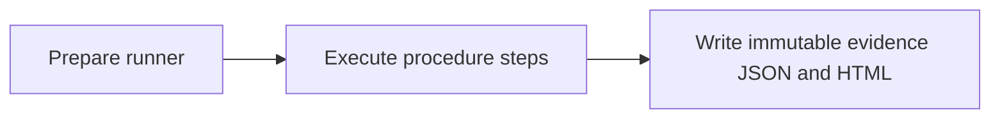

## What this test proves
The `colima-hermes-skills` procedure runs the named verification steps in order. Each step records an observable result in the run evidence. The page is addressed by the runner revision so a historical report remains explainable after the runner changes.

## Flow

## Steps
| step | action | observable | evidence |
| --- | --- | --- | --- |
| 1 | Run `advertised host` | PASS or FAIL is recorded | `colima-hermes-skills.json` cases |
| 2 | Run `atm-hermes-ready / tester: Ping` | PASS or FAIL is recorded | `colima-hermes-skills.json` cases |
| 3 | Run `atm-hermes-ready / tester: Pong` | PASS or FAIL is recorded | `colima-hermes-skills.json` cases |
| 4 | Run `atm-hermes-ready / tester: Receivers registered` | PASS or FAIL is recorded | `colima-hermes-skills.json` cases |
| 5 | Run `atm-hermes-ready / tester: Roster` | PASS or FAIL is recorded | `colima-hermes-skills.json` cases |
| 6 | Run `atm-hermes-ready / tester: Start line` | PASS or FAIL is recorded | `colima-hermes-skills.json` cases |
| 7 | Run `atm-nudge-roundtrip / hermes: Ack natively` | PASS or FAIL is recorded | `colima-hermes-skills.json` cases |
| 8 | Run `atm-nudge-roundtrip / hermes: List after idle` | PASS or FAIL is recorded | `colima-hermes-skills.json` cases |
| 9 | Run `atm-nudge-roundtrip / hermes: Nudge received` | PASS or FAIL is recorded | `colima-hermes-skills.json` cases |
| 10 | Run `atm-nudge-roundtrip / hermes: Read by id` | PASS or FAIL is recorded | `colima-hermes-skills.json` cases |
| 11 | Run `atm-nudge-roundtrip / hermes: Start line` | PASS or FAIL is recorded | `colima-hermes-skills.json` cases |
| 12 | Run `atm-nudge-roundtrip / tester: Ack arrives` | PASS or FAIL is recorded | `colima-hermes-skills.json` cases |
| 13 | Run `atm-nudge-roundtrip / tester: Send` | PASS or FAIL is recorded | `colima-hermes-skills.json` cases |
| 14 | Run `atm-nudge-roundtrip / tester: Start line` | PASS or FAIL is recorded | `colima-hermes-skills.json` cases |
| 15 | Run `atm-setup-environment / hermes: Daemon answers` | PASS or FAIL is recorded | `colima-hermes-skills.json` cases |
| 16 | Run `atm-setup-environment / hermes: Doctor passes` | PASS or FAIL is recorded | `colima-hermes-skills.json` cases |
| 17 | Run `atm-setup-environment / hermes: Roster complete` | PASS or FAIL is recorded | `colima-hermes-skills.json` cases |
| 18 | Run `atm-setup-environment / hermes: Self round trip` | PASS or FAIL is recorded | `colima-hermes-skills.json` cases |
| 19 | Run `atm-setup-environment / hermes: Start line` | PASS or FAIL is recorded | `colima-hermes-skills.json` cases |
| 20 | Run `atm-setup-environment / tester: Cross-host peer` | PASS or FAIL is recorded | `colima-hermes-skills.json` cases |
| 21 | Run `atm-setup-environment / tester: Daemon answers` | PASS or FAIL is recorded | `colima-hermes-skills.json` cases |
| 22 | Run `atm-setup-environment / tester: Doctor passes` | PASS or FAIL is recorded | `colima-hermes-skills.json` cases |
| 23 | Run `atm-setup-environment / tester: Roster complete` | PASS or FAIL is recorded | `colima-hermes-skills.json` cases |
| 24 | Run `atm-setup-environment / tester: Self round trip` | PASS or FAIL is recorded | `colima-hermes-skills.json` cases |
| 25 | Run `atm-setup-environment / tester: Start line` | PASS or FAIL is recorded | `colima-hermes-skills.json` cases |
| 26 | Run `atm-smoke / hermes: Ack` | PASS or FAIL is recorded | `colima-hermes-skills.json` cases |
| 27 | Run `atm-smoke / hermes: Partner ack received` | PASS or FAIL is recorded | `colima-hermes-skills.json` cases |
| 28 | Run `atm-smoke / hermes: Partner message arrives` | PASS or FAIL is recorded | `colima-hermes-skills.json` cases |
| 29 | Run `atm-smoke / hermes: Peek does not mutate` | PASS or FAIL is recorded | `colima-hermes-skills.json` cases |
| 30 | Run `atm-smoke / hermes: Read by id` | PASS or FAIL is recorded | `colima-hermes-skills.json` cases |
| 31 | Run `atm-smoke / hermes: Read marked it` | PASS or FAIL is recorded | `colima-hermes-skills.json` cases |
| 32 | Run `atm-smoke / hermes: Self round trip` | PASS or FAIL is recorded | `colima-hermes-skills.json` cases |
| 33 | Run `atm-smoke / hermes: Send` | PASS or FAIL is recorded | `colima-hermes-skills.json` cases |
| 34 | Run `atm-smoke / hermes: Stale-connection probe` | PASS or FAIL is recorded | `colima-hermes-skills.json` cases |
| 35 | Run `atm-smoke / hermes: Your message got acked` | PASS or FAIL is recorded | `colima-hermes-skills.json` cases |
| 36 | Run `atm-smoke / tester: Ack` | PASS or FAIL is recorded | `colima-hermes-skills.json` cases |
| 37 | Run `atm-smoke / tester: Partner's ack reply` | PASS or FAIL is recorded | `colima-hermes-skills.json` cases |
| 38 | Run `atm-smoke / tester: Partner's message arrives` | PASS or FAIL is recorded | `colima-hermes-skills.json` cases |
| 39 | Run `atm-smoke / tester: Peek does not mutate` | PASS or FAIL is recorded | `colima-hermes-skills.json` cases |
| 40 | Run `atm-smoke / tester: Read by id` | PASS or FAIL is recorded | `colima-hermes-skills.json` cases |
| 41 | Run `atm-smoke / tester: Read marked it` | PASS or FAIL is recorded | `colima-hermes-skills.json` cases |
| 42 | Run `atm-smoke / tester: Self round trip` | PASS or FAIL is recorded | `colima-hermes-skills.json` cases |
| 43 | Run `atm-smoke / tester: Send` | PASS or FAIL is recorded | `colima-hermes-skills.json` cases |
| 44 | Run `atm-smoke / tester: Stale-connection probe` | PASS or FAIL is recorded | `colima-hermes-skills.json` cases |
| 45 | Run `atm-smoke / tester: Start line` | PASS or FAIL is recorded | `colima-hermes-skills.json` cases |
| 46 | Run `atm-smoke / tester: Your message got acked` | PASS or FAIL is recorded | `colima-hermes-skills.json` cases |
| 47 | Run `doctor` | PASS or FAIL is recorded | `colima-hermes-skills.json` cases |
| 48 | Run `herdr transport (atm doctor, fixture daemon)` | PASS or FAIL is recorded | `colima-hermes-skills.json` cases |

## Evidence layout
The runner writes a procedure JSON payload beside its rendered report and an envelope used by the public report index. Existing evidence artifacts are immutable.

## Changes
This page is backfilled from the runner history; revision-specific notes are listed below.

## Revision 1595424d (2026-09-12)
current.

## Steps
| step | action | observable | evidence |
| --- | --- | --- | --- |
| 1 | Run `advertised host` | PASS or FAIL is recorded | `colima-hermes-skills.json` cases |
| 2 | Run `atm-hermes-ready / tester: Ping` | PASS or FAIL is recorded | `colima-hermes-skills.json` cases |
| 3 | Run `atm-hermes-ready / tester: Pong` | PASS or FAIL is recorded | `colima-hermes-skills.json` cases |
| 4 | Run `atm-hermes-ready / tester: Receivers registered` | PASS or FAIL is recorded | `colima-hermes-skills.json` cases |
| 5 | Run `atm-hermes-ready / tester: Roster` | PASS or FAIL is recorded | `colima-hermes-skills.json` cases |
| 6 | Run `atm-hermes-ready / tester: Start line` | PASS or FAIL is recorded | `colima-hermes-skills.json` cases |
| 7 | Run `atm-nudge-roundtrip / hermes: Ack natively` | PASS or FAIL is recorded | `colima-hermes-skills.json` cases |
| 8 | Run `atm-nudge-roundtrip / hermes: List after idle` | PASS or FAIL is recorded | `colima-hermes-skills.json` cases |
| 9 | Run `atm-nudge-roundtrip / hermes: Nudge received` | PASS or FAIL is recorded | `colima-hermes-skills.json` cases |
| 10 | Run `atm-nudge-roundtrip / hermes: Read by id` | PASS or FAIL is recorded | `colima-hermes-skills.json` cases |
| 11 | Run `atm-nudge-roundtrip / hermes: Start line` | PASS or FAIL is recorded | `colima-hermes-skills.json` cases |
| 12 | Run `atm-nudge-roundtrip / tester: Ack arrives` | PASS or FAIL is recorded | `colima-hermes-skills.json` cases |
| 13 | Run `atm-nudge-roundtrip / tester: Send` | PASS or FAIL is recorded | `colima-hermes-skills.json` cases |
| 14 | Run `atm-nudge-roundtrip / tester: Start line` | PASS or FAIL is recorded | `colima-hermes-skills.json` cases |
| 15 | Run `atm-setup-environment / hermes: Daemon answers` | PASS or FAIL is recorded | `colima-hermes-skills.json` cases |
| 16 | Run `atm-setup-environment / hermes: Doctor passes` | PASS or FAIL is recorded | `colima-hermes-skills.json` cases |
| 17 | Run `atm-setup-environment / hermes: Roster complete` | PASS or FAIL is recorded | `colima-hermes-skills.json` cases |
| 18 | Run `atm-setup-environment / hermes: Self round trip` | PASS or FAIL is recorded | `colima-hermes-skills.json` cases |
| 19 | Run `atm-setup-environment / hermes: Start line` | PASS or FAIL is recorded | `colima-hermes-skills.json` cases |
| 20 | Run `atm-setup-environment / tester: Cross-host peer` | PASS or FAIL is recorded | `colima-hermes-skills.json` cases |
| 21 | Run `atm-setup-environment / tester: Daemon answers` | PASS or FAIL is recorded | `colima-hermes-skills.json` cases |
| 22 | Run `atm-setup-environment / tester: Doctor passes` | PASS or FAIL is recorded | `colima-hermes-skills.json` cases |
| 23 | Run `atm-setup-environment / tester: Roster complete` | PASS or FAIL is recorded | `colima-hermes-skills.json` cases |
| 24 | Run `atm-setup-environment / tester: Self round trip` | PASS or FAIL is recorded | `colima-hermes-skills.json` cases |
| 25 | Run `atm-setup-environment / tester: Start line` | PASS or FAIL is recorded | `colima-hermes-skills.json` cases |
| 26 | Run `atm-smoke / hermes: Ack` | PASS or FAIL is recorded | `colima-hermes-skills.json` cases |
| 27 | Run `atm-smoke / hermes: Partner ack received` | PASS or FAIL is recorded | `colima-hermes-skills.json` cases |
| 28 | Run `atm-smoke / hermes: Partner message arrives` | PASS or FAIL is recorded | `colima-hermes-skills.json` cases |
| 29 | Run `atm-smoke / hermes: Peek does not mutate` | PASS or FAIL is recorded | `colima-hermes-skills.json` cases |
| 30 | Run `atm-smoke / hermes: Read by id` | PASS or FAIL is recorded | `colima-hermes-skills.json` cases |
| 31 | Run `atm-smoke / hermes: Read marked it` | PASS or FAIL is recorded | `colima-hermes-skills.json` cases |
| 32 | Run `atm-smoke / hermes: Self round trip` | PASS or FAIL is recorded | `colima-hermes-skills.json` cases |
| 33 | Run `atm-smoke / hermes: Send` | PASS or FAIL is recorded | `colima-hermes-skills.json` cases |
| 34 | Run `atm-smoke / hermes: Stale-connection probe` | PASS or FAIL is recorded | `colima-hermes-skills.json` cases |
| 35 | Run `atm-smoke / hermes: Your message got acked` | PASS or FAIL is recorded | `colima-hermes-skills.json` cases |
| 36 | Run `atm-smoke / tester: Ack` | PASS or FAIL is recorded | `colima-hermes-skills.json` cases |
| 37 | Run `atm-smoke / tester: Partner's ack reply` | PASS or FAIL is recorded | `colima-hermes-skills.json` cases |
| 38 | Run `atm-smoke / tester: Partner's message arrives` | PASS or FAIL is recorded | `colima-hermes-skills.json` cases |
| 39 | Run `atm-smoke / tester: Peek does not mutate` | PASS or FAIL is recorded | `colima-hermes-skills.json` cases |
| 40 | Run `atm-smoke / tester: Read by id` | PASS or FAIL is recorded | `colima-hermes-skills.json` cases |
| 41 | Run `atm-smoke / tester: Read marked it` | PASS or FAIL is recorded | `colima-hermes-skills.json` cases |
| 42 | Run `atm-smoke / tester: Self round trip` | PASS or FAIL is recorded | `colima-hermes-skills.json` cases |
| 43 | Run `atm-smoke / tester: Send` | PASS or FAIL is recorded | `colima-hermes-skills.json` cases |
| 44 | Run `atm-smoke / tester: Stale-connection probe` | PASS or FAIL is recorded | `colima-hermes-skills.json` cases |
| 45 | Run `atm-smoke / tester: Start line` | PASS or FAIL is recorded | `colima-hermes-skills.json` cases |
| 46 | Run `atm-smoke / tester: Your message got acked` | PASS or FAIL is recorded | `colima-hermes-skills.json` cases |
| 47 | Run `doctor` | PASS or FAIL is recorded | `colima-hermes-skills.json` cases |
| 48 | Run `herdr transport (atm doctor, fixture daemon)` | PASS or FAIL is recorded | `colima-hermes-skills.json` cases |

## Revision 6040ecf3 (2026-09-08)
historical runner revision.

## Steps
| step | action | observable | evidence |
| --- | --- | --- | --- |
| 1 | Run `advertised host` | PASS or FAIL is recorded | `colima-hermes-skills.json` cases |
| 2 | Run `atm-hermes-ready / tester: Ping` | PASS or FAIL is recorded | `colima-hermes-skills.json` cases |
| 3 | Run `atm-hermes-ready / tester: Pong` | PASS or FAIL is recorded | `colima-hermes-skills.json` cases |
| 4 | Run `atm-hermes-ready / tester: Receivers registered` | PASS or FAIL is recorded | `colima-hermes-skills.json` cases |
| 5 | Run `atm-hermes-ready / tester: Roster` | PASS or FAIL is recorded | `colima-hermes-skills.json` cases |
| 6 | Run `atm-hermes-ready / tester: Start line` | PASS or FAIL is recorded | `colima-hermes-skills.json` cases |
| 7 | Run `atm-nudge-roundtrip / hermes: Ack natively` | PASS or FAIL is recorded | `colima-hermes-skills.json` cases |
| 8 | Run `atm-nudge-roundtrip / hermes: List after idle` | PASS or FAIL is recorded | `colima-hermes-skills.json` cases |
| 9 | Run `atm-nudge-roundtrip / hermes: Nudge received` | PASS or FAIL is recorded | `colima-hermes-skills.json` cases |
| 10 | Run `atm-nudge-roundtrip / hermes: Read by id` | PASS or FAIL is recorded | `colima-hermes-skills.json` cases |
| 11 | Run `atm-nudge-roundtrip / hermes: Start line` | PASS or FAIL is recorded | `colima-hermes-skills.json` cases |
| 12 | Run `atm-nudge-roundtrip / tester: Ack arrives` | PASS or FAIL is recorded | `colima-hermes-skills.json` cases |
| 13 | Run `atm-nudge-roundtrip / tester: Send` | PASS or FAIL is recorded | `colima-hermes-skills.json` cases |
| 14 | Run `atm-nudge-roundtrip / tester: Start line` | PASS or FAIL is recorded | `colima-hermes-skills.json` cases |
| 15 | Run `atm-setup-environment / hermes: Daemon answers` | PASS or FAIL is recorded | `colima-hermes-skills.json` cases |
| 16 | Run `atm-setup-environment / hermes: Doctor passes` | PASS or FAIL is recorded | `colima-hermes-skills.json` cases |
| 17 | Run `atm-setup-environment / hermes: Roster complete` | PASS or FAIL is recorded | `colima-hermes-skills.json` cases |
| 18 | Run `atm-setup-environment / hermes: Self round trip` | PASS or FAIL is recorded | `colima-hermes-skills.json` cases |
| 19 | Run `atm-setup-environment / hermes: Start line` | PASS or FAIL is recorded | `colima-hermes-skills.json` cases |
| 20 | Run `atm-setup-environment / tester: Cross-host peer` | PASS or FAIL is recorded | `colima-hermes-skills.json` cases |
| 21 | Run `atm-setup-environment / tester: Daemon answers` | PASS or FAIL is recorded | `colima-hermes-skills.json` cases |
| 22 | Run `atm-setup-environment / tester: Doctor passes` | PASS or FAIL is recorded | `colima-hermes-skills.json` cases |
| 23 | Run `atm-setup-environment / tester: Roster complete` | PASS or FAIL is recorded | `colima-hermes-skills.json` cases |
| 24 | Run `atm-setup-environment / tester: Self round trip` | PASS or FAIL is recorded | `colima-hermes-skills.json` cases |
| 25 | Run `atm-setup-environment / tester: Start line` | PASS or FAIL is recorded | `colima-hermes-skills.json` cases |
| 26 | Run `atm-smoke / hermes: Ack` | PASS or FAIL is recorded | `colima-hermes-skills.json` cases |
| 27 | Run `atm-smoke / hermes: Partner ack received` | PASS or FAIL is recorded | `colima-hermes-skills.json` cases |
| 28 | Run `atm-smoke / hermes: Partner message arrives` | PASS or FAIL is recorded | `colima-hermes-skills.json` cases |
| 29 | Run `atm-smoke / hermes: Peek does not mutate` | PASS or FAIL is recorded | `colima-hermes-skills.json` cases |
| 30 | Run `atm-smoke / hermes: Read by id` | PASS or FAIL is recorded | `colima-hermes-skills.json` cases |
| 31 | Run `atm-smoke / hermes: Read marked it` | PASS or FAIL is recorded | `colima-hermes-skills.json` cases |
| 32 | Run `atm-smoke / hermes: Self round trip` | PASS or FAIL is recorded | `colima-hermes-skills.json` cases |
| 33 | Run `atm-smoke / hermes: Send` | PASS or FAIL is recorded | `colima-hermes-skills.json` cases |
| 34 | Run `atm-smoke / hermes: Stale-connection probe` | PASS or FAIL is recorded | `colima-hermes-skills.json` cases |
| 35 | Run `atm-smoke / hermes: Your message got acked` | PASS or FAIL is recorded | `colima-hermes-skills.json` cases |
| 36 | Run `atm-smoke / tester: Ack` | PASS or FAIL is recorded | `colima-hermes-skills.json` cases |
| 37 | Run `atm-smoke / tester: Partner's ack reply` | PASS or FAIL is recorded | `colima-hermes-skills.json` cases |
| 38 | Run `atm-smoke / tester: Partner's message arrives` | PASS or FAIL is recorded | `colima-hermes-skills.json` cases |
| 39 | Run `atm-smoke / tester: Peek does not mutate` | PASS or FAIL is recorded | `colima-hermes-skills.json` cases |
| 40 | Run `atm-smoke / tester: Read by id` | PASS or FAIL is recorded | `colima-hermes-skills.json` cases |
| 41 | Run `atm-smoke / tester: Read marked it` | PASS or FAIL is recorded | `colima-hermes-skills.json` cases |
| 42 | Run `atm-smoke / tester: Self round trip` | PASS or FAIL is recorded | `colima-hermes-skills.json` cases |
| 43 | Run `atm-smoke / tester: Send` | PASS or FAIL is recorded | `colima-hermes-skills.json` cases |
| 44 | Run `atm-smoke / tester: Stale-connection probe` | PASS or FAIL is recorded | `colima-hermes-skills.json` cases |
| 45 | Run `atm-smoke / tester: Start line` | PASS or FAIL is recorded | `colima-hermes-skills.json` cases |
| 46 | Run `atm-smoke / tester: Your message got acked` | PASS or FAIL is recorded | `colima-hermes-skills.json` cases |
| 47 | Run `doctor` | PASS or FAIL is recorded | `colima-hermes-skills.json` cases |
| 48 | Run `herdr transport (atm doctor, fixture daemon)` | PASS or FAIL is recorded | `colima-hermes-skills.json` cases |

