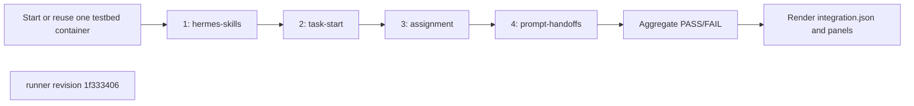

## What this test proves
One colima invocation starts or reuses one Hermes testbed container and runs the selected integration steps in their declared order. Every step records an independent verdict and command evidence, execution continues after a failed step, and the aggregate passes only when every selected step passes.

## Flow

## Steps
| step | action | observable | evidence |
| --- | --- | --- | --- |
| 1 | Run [`colima-hermes-skills`](colima-hermes-skills.md) in the fixture | the seven skill reports and fixture health checks have a retained verdict | `steps/NN-hermes-skills/step.json` and raw sidecars |
| 2 | Run [`colima-task-start`](colima-task-start.md) in the same fixture | task-start notification, ordering, and reminder cases have a retained verdict | `steps/NN-task-start/step.json` |
| 3 | Run [`colima-assignment`](colima-assignment.md) in the same fixture | assignment/task-pass cases have a retained verdict | `steps/NN-assignment/step.json` |
| 4 | Run [`colima-prompt-handoffs`](colima-prompt-handoffs.md) in the same fixture | task-linked prompt handoffs reconcile against the rows added during this step | `steps/NN-prompt-handoffs/step.json` |

## Evidence layout
The driver writes exactly one run directory under `site/reports/integration/colima/<run>/`. Step runners own only the `step.json` and raw sidecars in the directory passed by the driver. `scripts/integration/render_colima.py` is the sole renderer for step panels, the run page, `integration.json`, and the sibling envelope. `--steps` may select a subset, but selected steps retain the sequence order above.

## Changes
The revision sections below identify each driver revision that produced committed evidence.

## Revision 1f333406 (2026-09-13)
The initial unified driver starts or reuses one testbed container, executes every selected step in canonical order, records failures without stopping later steps, and delegates all reporting to the integration renderer.

## Steps
| step | action | observable | evidence |
| --- | --- | --- | --- |
| 1 | Run [`colima-hermes-skills`](colima-hermes-skills.md) in the fixture | the seven skill reports and fixture health checks have a retained verdict | `steps/NN-hermes-skills/step.json` and raw sidecars |
| 2 | Run [`colima-task-start`](colima-task-start.md) in the same fixture | task-start notification, ordering, and reminder cases have a retained verdict | `steps/NN-task-start/step.json` |
| 3 | Run [`colima-assignment`](colima-assignment.md) in the same fixture | assignment/task-pass cases have a retained verdict | `steps/NN-assignment/step.json` |
| 4 | Run [`colima-prompt-handoffs`](colima-prompt-handoffs.md) in the same fixture | task-linked prompt handoffs reconcile against the rows added during this step | `steps/NN-prompt-handoffs/step.json` |
