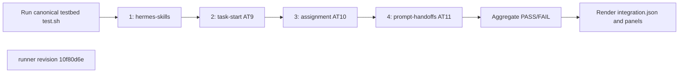
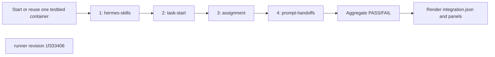

## What this test proves
One colima invocation runs the canonical Hermes testbed `test.sh`, then asks real agents in that fixture to execute AT9, AT10, and AT11. Every step records an independent verdict, execution continues after failure, and the aggregate passes only when all four panels pass.

## Flow

## Steps
| step | action | observable | evidence |
| --- | --- | --- | --- |
| 1 | Run `colima-hermes-skills` in the fixture | the seven skill reports and fixture health checks have a retained verdict | `steps/NN-hermes-skills/step.json` and raw sidecars |
| 2 | Run `colima-task-start` in the same fixture | task-start notification, ordering, and reminder cases have a retained verdict | `steps/NN-task-start/step.json` |
| 3 | Run `colima-assignment` in the same fixture | assignment/task-pass cases have a retained verdict | `steps/NN-assignment/step.json` |
| 4 | Run `colima-prompt-handoffs` in the same fixture | the fixture agent's public task-event and doctor observations have a retained verdict | `steps/NN-prompt-handoffs/step.json` |

## Evidence layout
The driver writes exactly one run directory under `site/reports/integration/colima/<run>/`. Step runners own only the `step.json` and raw sidecars in the directory passed by the driver. `scripts/integration/render_colima.py` is the sole renderer for step panels, the run page, `integration.json`, and the sibling envelope. The four steps always run in the sequence above.

## Changes
The revision sections below identify each driver revision that produced committed evidence.

## Revision 10f80d6e (2026-09-13)
The canonical testbed `test.sh` produces the first panel and leaves its fixture running. Real fixture agents then execute AT9, AT10, and AT11 in that same fixture; the driver collects their `prompt-report-1` JSON without inspecting product internals.

## Steps
| step | action | observable | evidence |
| --- | --- | --- | --- |
| 1 | Run `colima-hermes-skills` in the fixture | the seven skill reports and fixture health checks have a retained verdict | `steps/NN-hermes-skills/step.json` and raw sidecars |
| 2 | Run `colima-task-start` in the same fixture | task-start notification, ordering, and reminder cases have a retained verdict | `steps/NN-task-start/step.json` |
| 3 | Run `colima-assignment` in the same fixture | assignment/task-pass cases have a retained verdict | `steps/NN-assignment/step.json` |
| 4 | Run `colima-prompt-handoffs` in the same fixture | the fixture agent's public task-event and doctor observations have a retained verdict | `steps/NN-prompt-handoffs/step.json` |

## Revision 1f333406 (2026-09-13)
The initial unified driver starts or reuses one testbed container, executes every selected step in canonical order, records failures without stopping later steps, and delegates all reporting to the integration renderer.

## Steps
| step | action | observable | evidence |
| --- | --- | --- | --- |
| 1 | Run `colima-hermes-skills` in the fixture | the seven skill reports and fixture health checks have a retained verdict | `steps/NN-hermes-skills/step.json` and raw sidecars |
| 2 | Run `colima-task-start` in the same fixture | task-start notification, ordering, and reminder cases have a retained verdict | `steps/NN-task-start/step.json` |
| 3 | Run `colima-assignment` in the same fixture | assignment/task-pass cases have a retained verdict | `steps/NN-assignment/step.json` |
| 4 | Run `colima-prompt-handoffs` in the same fixture | the fixture agent's public task-event and doctor observations have a retained verdict | `steps/NN-prompt-handoffs/step.json` |
