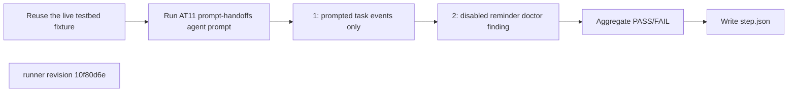
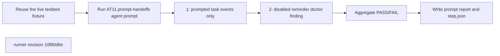
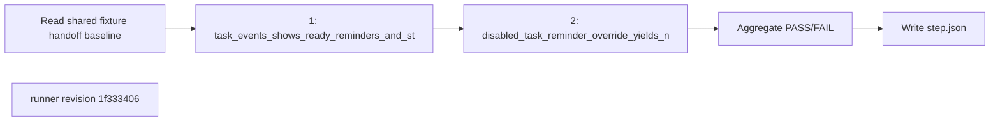
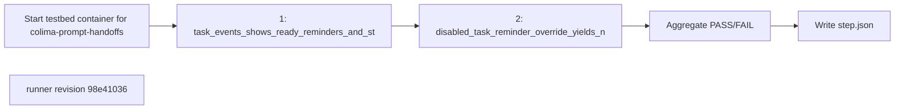

## What this test proves
Inside the shared colima testbed, a real agent executes prompt AT11 and observes only public ATM CLI JSON. Task events expose queued, ready, reminder, and started for the prompted task but queued only for later tasks; disabling reminders removes the reminder event and produces the documented doctor finding.

## Flow

## Steps
| step | action | observable | evidence |
| --- | --- | --- | --- |
| 1 | Tell the fixture agent to assign three tasks, wait for a reminder, and start the prompted task | `atm task events --json` shows queued, ready, reminder, started for task 1 and queued only for tasks 2–3 | `prompt-AT11.json` and `step.json` cases |
| 2 | Tell the agent to disable task reminders and assign another task | task events omit reminder and `atm doctor --json` reports `disabled_task_nudge_template_override` | `prompt-AT11.json` and `step.json` cases |

## Evidence layout
This procedure is one step of a colima integration run. The agent's unedited `prompt-report-1` JSON is retained beside `step.json`; `scripts/integration/render_colima.py` renders the panel and aggregate. Historical payloads remain byte-identical and render through the same path.

## Changes
The revision sections below list every runner revision that produced committed evidence, newest first. A run whose source revision is not an ancestor of any listed revision links to the revision in effect on its run date and is marked inferred.

## Revision 10f80d6e (2026-09-13)
The host-side handoff simulator and its storage inspection were deleted. A real fixture agent executes AT11 and reports only public `atm task events` and `atm doctor` observations.

## Steps
| step | action | observable | evidence |
| --- | --- | --- | --- |
| 1 | Tell the fixture agent to assign three tasks, wait for a reminder, and start the prompted task | `atm task events --json` shows queued, ready, reminder, started for task 1 and queued only for tasks 2–3 | `prompt-AT11.json` and `step.json` cases |
| 2 | Tell the agent to disable task reminders and assign another task | task events omit reminder and `atm doctor --json` reports `disabled_task_nudge_template_override` | `prompt-AT11.json` and `step.json` cases |

## Revision 1f333406 (2026-09-13)
The shared-fixture revision records the existing `prompt_handoffs` row count before this step, then reconciles only the rows added by the step. This preserves the exact terminal-line identity assertion without requiring a fresh container after earlier integration steps.

## Steps
| step | action | observable | evidence |
| --- | --- | --- | --- |
| 1 | `task_events_shows_ready_reminders_and_started_for_prompted_task_only`: record the shared-table baseline, assign three tasks, wait for reminders, start and close the prompted one | task events and prompt-handoff rows added after the baseline agree row for row, for the prompted task only; recorded PASS or FAIL at revision `1f333406` | `step.json` cases |
| 2 | `disabled_task_reminder_override_yields_no_handoff_and_doctor_finding`: disable the task reminder and assign | no handoff row is added and `atm doctor` reports the finding; recorded PASS or FAIL at revision `1f333406` | `step.json` cases |

## Revision a2491a6c (2026-09-12)
The runner change `test(smoke): exercise observed interval guard` is the source for this revision's procedure order.

## Steps
| step | action | observable | evidence |
| --- | --- | --- | --- |
| 1 | `task_events_shows_ready_reminders_and_started_for_prompted_task_only`: assign three tasks, wait for reminders, start and close the prompted one | task events and the prompt_handoffs table agree row for row, for the prompted task only; recorded PASS or FAIL at revision `a2491a6c` | `step.json` cases |
| 2 | `disabled_task_reminder_override_yields_no_handoff_and_doctor_finding`: disable the task reminder and assign | no handoff row is written and `atm doctor` reports the finding; recorded PASS or FAIL at revision `a2491a6c` | `step.json` cases |

## Revision 2cc19c18 (2026-09-12)
The runner change `test(smoke): cover observed reminder deadline` is the source for this revision's procedure order.

## Steps
| step | action | observable | evidence |
| --- | --- | --- | --- |
| 1 | `task_events_shows_ready_reminders_and_started_for_prompted_task_only`: assign three tasks, wait for reminders, start and close the prompted one | task events and the prompt_handoffs table agree row for row, for the prompted task only; recorded PASS or FAIL at revision `2cc19c18` | `step.json` cases |
| 2 | `disabled_task_reminder_override_yields_no_handoff_and_doctor_finding`: disable the task reminder and assign | no handoff row is written and `atm doctor` reports the finding; recorded PASS or FAIL at revision `2cc19c18` | `step.json` cases |

## Revision 6d18058c (2026-09-12)
The runner change `fix(smoke): bound disabled reminder wait by observed interval (BB6-026)` is the source for this revision's procedure order.

## Steps
| step | action | observable | evidence |
| --- | --- | --- | --- |
| 1 | `task_events_shows_ready_reminders_and_started_for_prompted_task_only`: assign three tasks, wait for reminders, start and close the prompted one | task events and the prompt_handoffs table agree row for row, for the prompted task only; recorded PASS or FAIL at revision `6d18058c` | `step.json` cases |
| 2 | `disabled_task_reminder_override_yields_no_handoff_and_doctor_finding`: disable the task reminder and assign | no handoff row is written and `atm doctor` reports the finding; recorded PASS or FAIL at revision `6d18058c` | `step.json` cases |

## Revision 054fd8b2 (2026-09-12)
The runner change `test(bb6): match handoffs by durable identity` is the source for this revision's procedure order.

## Steps
| step | action | observable | evidence |
| --- | --- | --- | --- |
| 1 | `task_events_shows_ready_reminders_and_started_for_prompted_task_only`: assign three tasks, wait for reminders, start and close the prompted one | task events and the prompt_handoffs table agree row for row, for the prompted task only; recorded PASS or FAIL at revision `054fd8b2` | `step.json` cases |
| 2 | `disabled_task_reminder_override_yields_no_handoff_and_doctor_finding`: disable the task reminder and assign | no handoff row is written and `atm doctor` reports the finding; recorded PASS or FAIL at revision `054fd8b2` | `step.json` cases |

## Revision 98e41036 (2026-09-12)
The runner change `test(bb6): bound bare mailbox evidence reads` is the source for this revision's procedure order.

## Steps
| step | action | observable | evidence |
| --- | --- | --- | --- |
| 1 | `task_events_shows_ready_reminders_and_started_for_prompted_task_only`: assign three tasks, wait for reminders, start and close the prompted one | task events and the prompt_handoffs table agree row for row, for the prompted task only; recorded PASS or FAIL at revision `98e41036` | `step.json` cases |
| 2 | `disabled_task_reminder_override_yields_no_handoff_and_doctor_finding`: disable the task reminder and assign | no handoff row is written and `atm doctor` reports the finding; recorded PASS or FAIL at revision `98e41036` | `step.json` cases |

## Revision f5cc8d38 (2026-09-12)
The runner change `test(bb6): reconcile all prompt recipient surfaces` is the source for this revision's procedure order.

## Steps
| step | action | observable | evidence |
| --- | --- | --- | --- |
| 1 | `task_events_shows_ready_reminders_and_started_for_prompted_task_only`: assign three tasks, wait for reminders, start and close the prompted one | task events and the prompt_handoffs table agree row for row, for the prompted task only; recorded PASS or FAIL at revision `f5cc8d38` | `step.json` cases |
| 2 | `disabled_task_reminder_override_yields_no_handoff_and_doctor_finding`: disable the task reminder and assign | no handoff row is written and `atm doctor` reports the finding; recorded PASS or FAIL at revision `f5cc8d38` | `step.json` cases |

## Revision 9429a997 (2026-09-12)
The runner change `test(bb6): add prompt handoff colima runner` is the source for this revision's procedure order.

## Steps
| step | action | observable | evidence |
| --- | --- | --- | --- |
| 1 | `task_events_shows_ready_reminders_and_started_for_prompted_task_only`: assign three tasks, wait for reminders, start and close the prompted one | task events and the prompt_handoffs table agree row for row, for the prompted task only; recorded PASS or FAIL at revision `9429a997` | `step.json` cases |
| 2 | `disabled_task_reminder_override_yields_no_handoff_and_doctor_finding`: disable the task reminder and assign | no handoff row is written and `atm doctor` reports the finding; recorded PASS or FAIL at revision `9429a997` | `step.json` cases |
