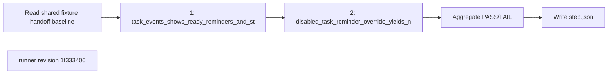
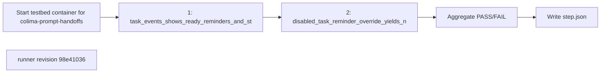

## What this test proves
Inside the shared colima testbed, the daemon records one durable prompt-handoff row per task-linked terminal line this step delivers (queued, ready, reminder, started, complete) and matches the rows added after the step baseline by durable identity; a disabled reminder override yields no handoff and a doctor finding.

## Flow

## Steps
| step | action | observable | evidence |
| --- | --- | --- | --- |
| 1 | `task_events_shows_ready_reminders_and_started_for_prompted_task_only`: record the shared-table baseline, assign three tasks, wait for reminders, start and close the prompted one | task events and prompt-handoff rows added after the baseline agree row for row, for the prompted task only; recorded PASS or FAIL at revision `1f333406` | `step.json` cases |
| 2 | `disabled_task_reminder_override_yields_no_handoff_and_doctor_finding`: disable the task reminder and assign | no handoff row is added and `atm doctor` reports the finding; recorded PASS or FAIL at revision `1f333406` | `step.json` cases |

## Evidence layout
This procedure is one step of a colima integration run. The runner's payload is kept byte-for-byte as `steps/NN-prompt-handoffs/step.json` under `site/reports/integration/colima/<run>/`; the step's `panel.xhtml` and the run's `index.html`, `integration.json` and envelope are rendered from it by `scripts/integration/render_colima.py`. Historical runs made before the integration layout existed were moved into it unchanged and are rendered by the same code.

## Changes
The revision sections below list every runner revision that produced committed evidence, newest first. A run whose source revision is not an ancestor of any listed revision links to the revision in effect on its run date and is marked inferred.

## Revision 1f333406 (2026-09-13)
The shared-fixture revision records the existing `prompt_handoffs` row count before this step, then reconciles only the rows added by the step. This preserves the exact terminal-line identity assertion without requiring a fresh container after earlier integration steps.

## Steps
| step | action | observable | evidence |
| --- | --- | --- | --- |
| 1 | `task_events_shows_ready_reminders_and_started_for_prompted_task_only`: record the shared-table baseline, assign three tasks, wait for reminders, start and close the prompted one | task events and prompt-handoff rows added after the baseline agree row for row, for the prompted task only; recorded PASS or FAIL at revision `1f333406` | `step.json` cases |
| 2 | `disabled_task_reminder_override_yields_no_handoff_and_doctor_finding`: disable the task reminder and assign | no handoff row is added and `atm doctor` reports the finding; recorded PASS or FAIL at revision `1f333406` | `step.json` cases |

## Revision a2491a6c (2026-09-12)
The runner change `test(smoke): exercise observed interval guard` is the source for this revision's procedure order.

## Steps
| step | action | observable | evidence |
| --- | --- | --- | --- |
| 1 | `task_events_shows_ready_reminders_and_started_for_prompted_task_only`: assign three tasks, wait for reminders, start and close the prompted one | task events and the prompt_handoffs table agree row for row, for the prompted task only; recorded PASS or FAIL at revision `a2491a6c` | `step.json` cases |
| 2 | `disabled_task_reminder_override_yields_no_handoff_and_doctor_finding`: disable the task reminder and assign | no handoff row is written and `atm doctor` reports the finding; recorded PASS or FAIL at revision `a2491a6c` | `step.json` cases |

## Revision 2cc19c18 (2026-09-12)
The runner change `test(smoke): cover observed reminder deadline` is the source for this revision's procedure order.

## Steps
| step | action | observable | evidence |
| --- | --- | --- | --- |
| 1 | `task_events_shows_ready_reminders_and_started_for_prompted_task_only`: assign three tasks, wait for reminders, start and close the prompted one | task events and the prompt_handoffs table agree row for row, for the prompted task only; recorded PASS or FAIL at revision `2cc19c18` | `step.json` cases |
| 2 | `disabled_task_reminder_override_yields_no_handoff_and_doctor_finding`: disable the task reminder and assign | no handoff row is written and `atm doctor` reports the finding; recorded PASS or FAIL at revision `2cc19c18` | `step.json` cases |

## Revision 6d18058c (2026-09-12)
The runner change `fix(smoke): bound disabled reminder wait by observed interval (BB6-026)` is the source for this revision's procedure order.

## Steps
| step | action | observable | evidence |
| --- | --- | --- | --- |
| 1 | `task_events_shows_ready_reminders_and_started_for_prompted_task_only`: assign three tasks, wait for reminders, start and close the prompted one | task events and the prompt_handoffs table agree row for row, for the prompted task only; recorded PASS or FAIL at revision `6d18058c` | `step.json` cases |
| 2 | `disabled_task_reminder_override_yields_no_handoff_and_doctor_finding`: disable the task reminder and assign | no handoff row is written and `atm doctor` reports the finding; recorded PASS or FAIL at revision `6d18058c` | `step.json` cases |

## Revision 054fd8b2 (2026-09-12)
The runner change `test(bb6): match handoffs by durable identity` is the source for this revision's procedure order.

## Steps
| step | action | observable | evidence |
| --- | --- | --- | --- |
| 1 | `task_events_shows_ready_reminders_and_started_for_prompted_task_only`: assign three tasks, wait for reminders, start and close the prompted one | task events and the prompt_handoffs table agree row for row, for the prompted task only; recorded PASS or FAIL at revision `054fd8b2` | `step.json` cases |
| 2 | `disabled_task_reminder_override_yields_no_handoff_and_doctor_finding`: disable the task reminder and assign | no handoff row is written and `atm doctor` reports the finding; recorded PASS or FAIL at revision `054fd8b2` | `step.json` cases |

## Revision 98e41036 (2026-09-12)
The runner change `test(bb6): bound bare mailbox evidence reads` is the source for this revision's procedure order.

## Steps
| step | action | observable | evidence |
| --- | --- | --- | --- |
| 1 | `task_events_shows_ready_reminders_and_started_for_prompted_task_only`: assign three tasks, wait for reminders, start and close the prompted one | task events and the prompt_handoffs table agree row for row, for the prompted task only; recorded PASS or FAIL at revision `98e41036` | `step.json` cases |
| 2 | `disabled_task_reminder_override_yields_no_handoff_and_doctor_finding`: disable the task reminder and assign | no handoff row is written and `atm doctor` reports the finding; recorded PASS or FAIL at revision `98e41036` | `step.json` cases |

## Revision f5cc8d38 (2026-09-12)
The runner change `test(bb6): reconcile all prompt recipient surfaces` is the source for this revision's procedure order.

## Steps
| step | action | observable | evidence |
| --- | --- | --- | --- |
| 1 | `task_events_shows_ready_reminders_and_started_for_prompted_task_only`: assign three tasks, wait for reminders, start and close the prompted one | task events and the prompt_handoffs table agree row for row, for the prompted task only; recorded PASS or FAIL at revision `f5cc8d38` | `step.json` cases |
| 2 | `disabled_task_reminder_override_yields_no_handoff_and_doctor_finding`: disable the task reminder and assign | no handoff row is written and `atm doctor` reports the finding; recorded PASS or FAIL at revision `f5cc8d38` | `step.json` cases |

## Revision 9429a997 (2026-09-12)
The runner change `test(bb6): add prompt handoff colima runner` is the source for this revision's procedure order.

## Steps
| step | action | observable | evidence |
| --- | --- | --- | --- |
| 1 | `task_events_shows_ready_reminders_and_started_for_prompted_task_only`: assign three tasks, wait for reminders, start and close the prompted one | task events and the prompt_handoffs table agree row for row, for the prompted task only; recorded PASS or FAIL at revision `9429a997` | `step.json` cases |
| 2 | `disabled_task_reminder_override_yields_no_handoff_and_doctor_finding`: disable the task reminder and assign | no handoff row is written and `atm doctor` reports the finding; recorded PASS or FAIL at revision `9429a997` | `step.json` cases |
