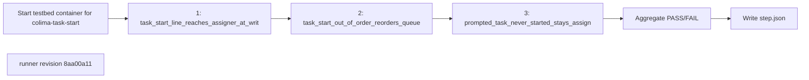

## What this test proves
Inside the colima testbed, `atm task start` writes the started line to the assigner's mailbox at write time, an out-of-order start reorders the assignee's queue, and a prompted task that is never started stays assigned and keeps reminding. Every command transcript is kept in the step payload.

## Flow

## Steps
| step | action | observable | evidence |
| --- | --- | --- | --- |
| 1 | `task_start_line_reaches_assigner_at_write_time`: assign a task, start it as the assignee, read the assigner's mailbox | the started line is already in the assigner's unread mail before the assigner reads; recorded PASS or FAIL at revision `8aa00a11` | `step.json` cases |
| 2 | `task_start_out_of_order_reorders_queue`: assign two tasks, start the second | the assignee's queue lists the started task first; recorded PASS or FAIL at revision `8aa00a11` | `step.json` cases |
| 3 | `prompted_task_never_started_stays_assigned_and_keeps_reminding`: assign a task and never start it | task events show repeated reminders and the task stays assigned; recorded PASS or FAIL at revision `8aa00a11` | `step.json` cases |

## Evidence layout
This procedure is one step of a colima integration run. The runner's payload is kept byte-for-byte as `steps/NN-task-start/step.json` under `site/reports/integration/colima/<run>/`; the step's `panel.xhtml` and the run's `index.html`, `integration.json` and envelope are rendered from it by `scripts/integration/render_colima.py`. Historical runs made before the integration layout existed were moved into it unchanged and are rendered by the same code.

## Changes
The revision sections below list every runner revision that produced committed evidence, newest first. A run whose source revision is not an ancestor of any listed revision links to the revision in effect on its run date and is marked inferred.

## Revision 8aa00a11 (2026-09-12)
The runner change `test(bb4): add task start CLI smoke suite` is the source for this revision's procedure order.

## Steps
| step | action | observable | evidence |
| --- | --- | --- | --- |
| 1 | `task_start_line_reaches_assigner_at_write_time`: assign a task, start it as the assignee, read the assigner's mailbox | the started line is already in the assigner's unread mail before the assigner reads; recorded PASS or FAIL at revision `8aa00a11` | `step.json` cases |
| 2 | `task_start_out_of_order_reorders_queue`: assign two tasks, start the second | the assignee's queue lists the started task first; recorded PASS or FAIL at revision `8aa00a11` | `step.json` cases |
| 3 | `prompted_task_never_started_stays_assigned_and_keeps_reminding`: assign a task and never start it | task events show repeated reminders and the task stays assigned; recorded PASS or FAIL at revision `8aa00a11` | `step.json` cases |
