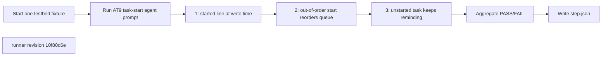
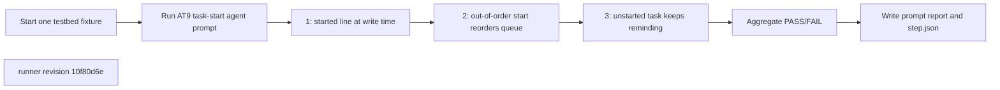
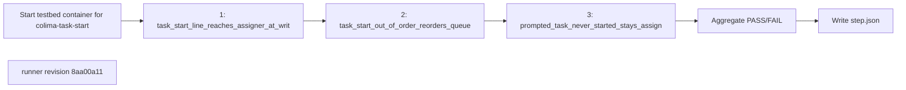

## What this test proves
Inside the colima testbed, a real agent executes prompt AT9 using only public ATM CLI observations. It proves that `atm task start` writes the started line to the assigner, an out-of-order start reorders the queue, and an unstarted task remains assigned and keeps reminding.

## Flow

## Steps
| step | action | observable | evidence |
| --- | --- | --- | --- |
| 1 | Tell the fixture agent to assign and start a task | `atm list/read --json` shows the started operation to the assigner | `prompt-AT9.json` and `step.json` cases |
| 2 | Tell the agent to assign two tasks and start the second | `atm task list --json` shows the active task ahead of the assigned task | `prompt-AT9.json` and `step.json` cases |
| 3 | Tell the agent to leave an assigned task unstarted | bounded `atm task events --json` polls show repeated reminders while it stays assigned | `prompt-AT9.json` and `step.json` cases |

## Evidence layout
This procedure is one step of a colima integration run. The agent's unedited `prompt-report-1` JSON is retained beside `step.json`; `scripts/integration/render_colima.py` renders the panel and aggregate. Historical payloads remain byte-identical and render through the same path.

## Changes
The revision sections below list every runner revision that produced committed evidence, newest first. A run whose source revision is not an ancestor of any listed revision links to the revision in effect on its run date and is marked inferred.

## Revision 10f80d6e (2026-09-13)
The host-side task simulator was deleted. The thin driver starts one testbed fixture and asks its real agent to execute AT9; every product assertion comes from public ATM CLI output recorded in `prompt-report-1`.

## Steps
| step | action | observable | evidence |
| --- | --- | --- | --- |
| 1 | Tell the fixture agent to assign and start a task | `atm list/read --json` shows the started operation to the assigner | `prompt-AT9.json` and `step.json` cases |
| 2 | Tell the agent to assign two tasks and start the second | `atm task list --json` shows the active task ahead of the assigned task | `prompt-AT9.json` and `step.json` cases |
| 3 | Tell the agent to leave an assigned task unstarted | bounded `atm task events --json` polls show repeated reminders while it stays assigned | `prompt-AT9.json` and `step.json` cases |

## Revision 8aa00a11 (2026-09-12)
The runner change `test(bb4): add task start CLI smoke suite` is the source for this revision's procedure order.

## Steps
| step | action | observable | evidence |
| --- | --- | --- | --- |
| 1 | `task_start_line_reaches_assigner_at_write_time`: assign a task, start it as the assignee, read the assigner's mailbox | the started line is already in the assigner's unread mail before the assigner reads; recorded PASS or FAIL at revision `8aa00a11` | `step.json` cases |
| 2 | `task_start_out_of_order_reorders_queue`: assign two tasks, start the second | the assignee's queue lists the started task first; recorded PASS or FAIL at revision `8aa00a11` | `step.json` cases |
| 3 | `prompted_task_never_started_stays_assigned_and_keeps_reminding`: assign a task and never start it | task events show repeated reminders and the task stays assigned; recorded PASS or FAIL at revision `8aa00a11` | `step.json` cases |
