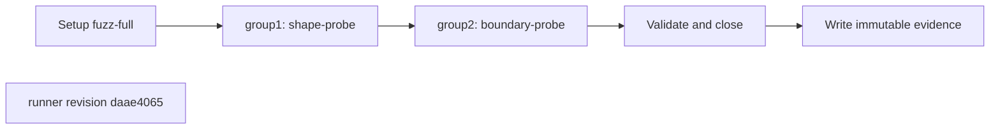
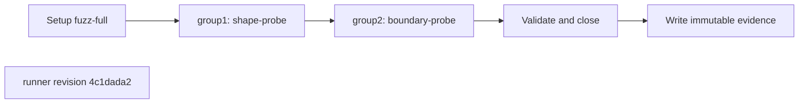
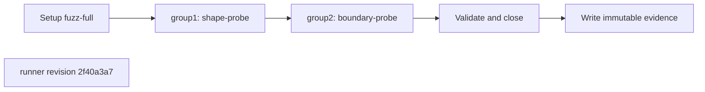

## What this test proves
This fuzz procedure runs the complete bounded worker set and classifies every negative case against the v2 diagnostic contract. Worker order is preserved so the campaign evidence can be audited directly.

## Flow

## Steps
| step | action | observable | evidence |
| --- | --- | --- | --- |
| 1 | Execute `shape-probe` | The named check reports PASS or FAIL at revision `daae4065` | campaign worker/family evidence |
| 2 | Execute `template-probe` | The named check reports PASS or FAIL at revision `daae4065` | campaign worker/family evidence |
| 3 | Execute `boundary-probe` | The named check reports PASS or FAIL at revision `daae4065` | campaign worker/family evidence |
| 4 | Execute `differential-probe` | The named check reports PASS or FAIL at revision `daae4065` | campaign worker/family evidence |

## Evidence layout
The runner writes immutable evidence for `fuzz-full` beneath `site/reports/`. The JSON payload is the source for case or worker outcomes; the rendered report and envelope provide the public navigation entry.

## Changes
The revision sections below are the retained runner-history backfill. Each section records the source revision and its own ordered procedure description.

## Revision daae4065 (2026-08-14)
The runner change `test(fuzz): retain typed HTTP rejection diagnostics` is the source for this revision's procedure order.

## Steps
| step | action | observable | evidence |
| --- | --- | --- | --- |
| 1 | Execute `shape-probe` | The named check reports PASS or FAIL at revision `daae4065` | campaign worker/family evidence |
| 2 | Execute `template-probe` | The named check reports PASS or FAIL at revision `daae4065` | campaign worker/family evidence |
| 3 | Execute `boundary-probe` | The named check reports PASS or FAIL at revision `daae4065` | campaign worker/family evidence |
| 4 | Execute `differential-probe` | The named check reports PASS or FAIL at revision `daae4065` | campaign worker/family evidence |

## Revision 4c1dada2 (2026-08-14)
The runner change `test(fuzz): add deterministic HTTP campaign` is the source for this revision's procedure order.

## Steps
| step | action | observable | evidence |
| --- | --- | --- | --- |
| 1 | Execute `shape-probe` | The named check reports PASS or FAIL at revision `4c1dada2` | campaign worker/family evidence |
| 2 | Execute `template-probe` | The named check reports PASS or FAIL at revision `4c1dada2` | campaign worker/family evidence |
| 3 | Execute `boundary-probe` | The named check reports PASS or FAIL at revision `4c1dada2` | campaign worker/family evidence |
| 4 | Execute `differential-probe` | The named check reports PASS or FAIL at revision `4c1dada2` | campaign worker/family evidence |

## Revision 2f40a3a7 (2026-07-31)
The runner change `feat: add bounded fuzz tooling contract` is the source for this revision's procedure order.

## Steps
| step | action | observable | evidence |
| --- | --- | --- | --- |
| 1 | Execute `shape-probe` | The named check reports PASS or FAIL at revision `2f40a3a7` | campaign worker/family evidence |
| 2 | Execute `template-probe` | The named check reports PASS or FAIL at revision `2f40a3a7` | campaign worker/family evidence |
| 3 | Execute `boundary-probe` | The named check reports PASS or FAIL at revision `2f40a3a7` | campaign worker/family evidence |
| 4 | Execute `differential-probe` | The named check reports PASS or FAIL at revision `2f40a3a7` | campaign worker/family evidence |
