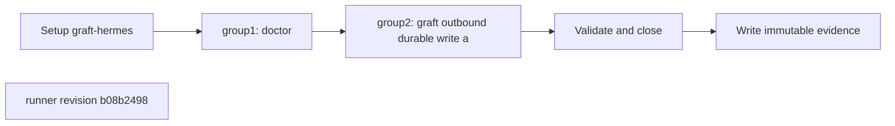

## What this test proves
The graft lane first requires the selected runtime pair to be ready, then performs one durable outbound write and a native acknowledgement round trip through the installed graft adapter.

## Flow

## Steps
| step | action | observable | evidence |
| --- | --- | --- | --- |
| 1 | Execute `doctor` | The named check reports PASS or FAIL at revision `b08b2498` | `graft-hermes.json` cases |
| 2 | Execute `graft outbound durable write and receiver round trip` | The named check reports PASS or FAIL at revision `b08b2498` | `graft-hermes.json` cases |

## Evidence layout
The runner writes immutable evidence for `graft-hermes` beneath `site/reports/`. The JSON payload is the source for case or worker outcomes; the rendered report and envelope provide the public navigation entry.

## Changes
The revision sections below are the retained runner-history backfill. Each section records the source revision and its own ordered procedure description.

## Revision b08b2498 (2026-08-11)
The runner change `fix(smoke): route Hermes graft acknowledgements through CLI` is the source for this revision's procedure order.

## Steps
| step | action | observable | evidence |
| --- | --- | --- | --- |
| 1 | Execute `doctor` | The named check reports PASS or FAIL at revision `b08b2498` | `graft-hermes.json` cases |
| 2 | Execute `graft outbound durable write and receiver round trip` | The named check reports PASS or FAIL at revision `b08b2498` | `graft-hermes.json` cases |
