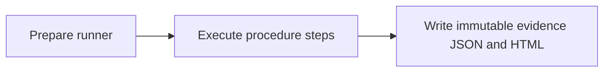

## What this test proves
The `graft-hermes` procedure runs the named verification steps in order. Each step records an observable result in the run evidence. The page is addressed by the runner revision so a historical report remains explainable after the runner changes.

## Flow

## Steps
| step | action | observable | evidence |
| --- | --- | --- | --- |
| 1 | Run `doctor` | PASS or FAIL is recorded | `graft-hermes.json` cases |
| 2 | Run `graft outbound durable write and receiver round trip` | PASS or FAIL is recorded | `graft-hermes.json` cases |

## Evidence layout
The runner writes a procedure JSON payload beside its rendered report and an envelope used by the public report index. Existing evidence artifacts are immutable.

## Changes
This page is backfilled from the runner history; revision-specific notes are listed below.

## Revision 1595424d (2026-09-12)
current.

## Steps
| step | action | observable | evidence |
| --- | --- | --- | --- |
| 1 | Run `doctor` | PASS or FAIL is recorded | `graft-hermes.json` cases |
| 2 | Run `graft outbound durable write and receiver round trip` | PASS or FAIL is recorded | `graft-hermes.json` cases |

## Revision bab416ca (2026-08-10)
historical runner revision.

## Steps
| step | action | observable | evidence |
| --- | --- | --- | --- |
| 1 | Run `doctor` | PASS or FAIL is recorded | `graft-hermes.json` cases |
| 2 | Run `graft outbound durable write and receiver round trip` | PASS or FAIL is recorded | `graft-hermes.json` cases |

