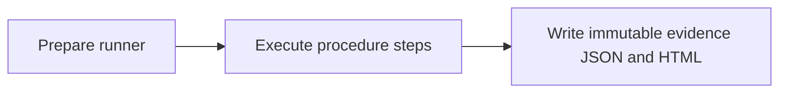

## What this test proves
The `read-query-benchmark` procedure runs the named verification steps in order. Each step records an observable result in the run evidence. The page is addressed by the runner revision so a historical report remains explainable after the runner changes.

## Flow

## Steps
| step | action | observable | evidence |
| --- | --- | --- | --- |
| 1 | Run `sqlite` | PASS or FAIL is recorded | `read-query-benchmark.json` cases |
| 2 | Run `uds` | PASS or FAIL is recorded | `read-query-benchmark.json` cases |
| 3 | Run `tcp` | PASS or FAIL is recorded | `read-query-benchmark.json` cases |
| 4 | Run `mTLS` | PASS or FAIL is recorded | `read-query-benchmark.json` cases |

## Evidence layout
The runner writes a procedure JSON payload beside its rendered report and an envelope used by the public report index. Existing evidence artifacts are immutable.

## Changes
This page is backfilled from the runner history; revision-specific notes are listed below.

## Revision 1595424d (2026-09-12)
current.

## Steps
| step | action | observable | evidence |
| --- | --- | --- | --- |
| 1 | Run `sqlite` | PASS or FAIL is recorded | `read-query-benchmark.json` cases |
| 2 | Run `uds` | PASS or FAIL is recorded | `read-query-benchmark.json` cases |
| 3 | Run `tcp` | PASS or FAIL is recorded | `read-query-benchmark.json` cases |
| 4 | Run `mTLS` | PASS or FAIL is recorded | `read-query-benchmark.json` cases |

## Revision bedcb4b8 (2026-07-31)
historical runner revision.

## Steps
| step | action | observable | evidence |
| --- | --- | --- | --- |
| 1 | Run `sqlite` | PASS or FAIL is recorded | `read-query-benchmark.json` cases |
| 2 | Run `uds` | PASS or FAIL is recorded | `read-query-benchmark.json` cases |
| 3 | Run `tcp` | PASS or FAIL is recorded | `read-query-benchmark.json` cases |
| 4 | Run `mTLS` | PASS or FAIL is recorded | `read-query-benchmark.json` cases |

