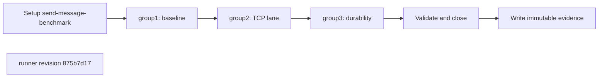
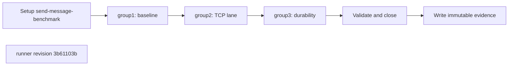

## What this test proves
The send-message benchmark runs the reviewed transport and durability lanes, records distribution statistics, and publishes one campaign summary whose rows map to the benchmark families.

## Flow

## Steps
| step | action | observable | evidence |
| --- | --- | --- | --- |
| 1 | Execute `baseline` | The named check reports PASS or FAIL at revision `875b7d17` | campaign worker/family evidence |
| 2 | Execute `UDS lane` | The named check reports PASS or FAIL at revision `875b7d17` | campaign worker/family evidence |
| 3 | Execute `TCP lane` | The named check reports PASS or FAIL at revision `875b7d17` | campaign worker/family evidence |
| 4 | Execute `mTLS lane` | The named check reports PASS or FAIL at revision `875b7d17` | campaign worker/family evidence |
| 5 | Execute `durability` | The named check reports PASS or FAIL at revision `875b7d17` | campaign worker/family evidence |

## Evidence layout
The runner writes immutable evidence for `send-message-benchmark` beneath `site/reports/`. The JSON payload is the source for case or worker outcomes; the rendered report and envelope provide the public navigation entry.

## Changes
The revision sections below are the retained runner-history backfill. Each section records the source revision and its own ordered procedure description.

## Revision 875b7d17 (2026-08-31)
The runner change `fix(av4): capture benchmark execution provenance` is the source for this revision's procedure order.

## Steps
| step | action | observable | evidence |
| --- | --- | --- | --- |
| 1 | Execute `baseline` | The named check reports PASS or FAIL at revision `875b7d17` | campaign worker/family evidence |
| 2 | Execute `UDS lane` | The named check reports PASS or FAIL at revision `875b7d17` | campaign worker/family evidence |
| 3 | Execute `TCP lane` | The named check reports PASS or FAIL at revision `875b7d17` | campaign worker/family evidence |
| 4 | Execute `mTLS lane` | The named check reports PASS or FAIL at revision `875b7d17` | campaign worker/family evidence |
| 5 | Execute `durability` | The named check reports PASS or FAIL at revision `875b7d17` | campaign worker/family evidence |

## Revision 3b61103b (2026-08-23)
The runner change `feat(benchmark): define v4 data contract` is the source for this revision's procedure order.

## Steps
| step | action | observable | evidence |
| --- | --- | --- | --- |
| 1 | Execute `baseline` | The named check reports PASS or FAIL at revision `3b61103b` | campaign worker/family evidence |
| 2 | Execute `UDS lane` | The named check reports PASS or FAIL at revision `3b61103b` | campaign worker/family evidence |
| 3 | Execute `TCP lane` | The named check reports PASS or FAIL at revision `3b61103b` | campaign worker/family evidence |
| 4 | Execute `mTLS lane` | The named check reports PASS or FAIL at revision `3b61103b` | campaign worker/family evidence |
| 5 | Execute `durability` | The named check reports PASS or FAIL at revision `3b61103b` | campaign worker/family evidence |

## Revision bedcb4b8 (2026-07-31)
The runner change `feat: add durable benchmark report pipeline` is the source for this revision's procedure order.

## Steps
| step | action | observable | evidence |
| --- | --- | --- | --- |
| 1 | Execute `baseline` | The named check reports PASS or FAIL at revision `bedcb4b8` | campaign worker/family evidence |
| 2 | Execute `UDS lane` | The named check reports PASS or FAIL at revision `bedcb4b8` | campaign worker/family evidence |
| 3 | Execute `TCP lane` | The named check reports PASS or FAIL at revision `bedcb4b8` | campaign worker/family evidence |
| 4 | Execute `mTLS lane` | The named check reports PASS or FAIL at revision `bedcb4b8` | campaign worker/family evidence |
| 5 | Execute `durability` | The named check reports PASS or FAIL at revision `bedcb4b8` | campaign worker/family evidence |
