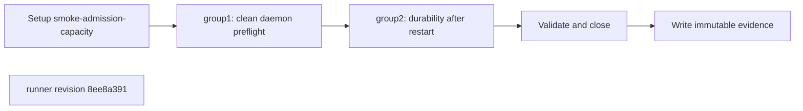
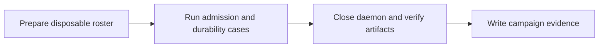
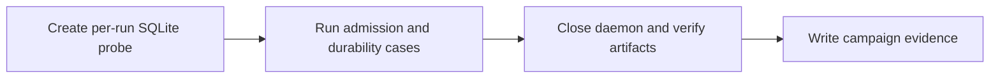
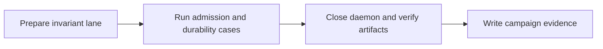

## What this test proves
The admission-capacity lane drives the local public admission boundary at its bounded target rate and records throughput, rejection, and durability evidence. The result is a benchmark-shaped smoke artifact with a stable procedure page.

## Flow

## Steps
| step | action | observable | evidence |
| --- | --- | --- | --- |
| 1 | Execute `clean daemon preflight` | The named check reports PASS or FAIL at revision `8ee8a391` | `smoke-admission-capacity.json` cases |
| 2 | Execute `bounded admission writes` | The named check reports PASS or FAIL at revision `8ee8a391` | `smoke-admission-capacity.json` cases |
| 3 | Execute `durability after restart` | The named check reports PASS or FAIL at revision `8ee8a391` | `smoke-admission-capacity.json` cases |
| 4 | Execute `throughput verdict` | The named check reports PASS or FAIL at revision `8ee8a391` | `smoke-admission-capacity.json` cases |

## Evidence layout
The admission runner leaves its bounded campaign JSON and rendered report under `site/reports/`. The payload records the preflight, write, durability, and throughput observations; the envelope makes the run discoverable in the public index.

## Changes
The revision sections below preserve the admission runner history. Each section names the implementation change that established its procedure order.

## Revision b193b950 (2026-09-06)
The runner checks the daemon doctor result after roster setup before measuring the admission lanes.

## Steps
| step | action | observable | evidence |
| --- | --- | --- | --- |
| 1 | Execute `clean daemon preflight` | Doctor is ready after roster setup | `smoke-admission-capacity.json` cases |
| 2 | Execute `bounded admission writes` | The bounded write rate is recorded | `smoke-admission-capacity.json` cases |
| 3 | Execute `durability after restart` | Restart preserves the durable rows | `smoke-admission-capacity.json` cases |
| 4 | Execute `throughput verdict` | The reviewed threshold verdict is recorded | `smoke-admission-capacity.json` cases |

## Revision 0817d87b (2026-09-04)
The runner probes the launched daemon runtime before entering the bounded admission measurement.

## Steps
| step | action | observable | evidence |
| --- | --- | --- | --- |
| 1 | Execute `clean daemon preflight` | The launched runtime answers doctor | `smoke-admission-capacity.json` cases |
| 2 | Execute `bounded admission writes` | The bounded write rate is recorded | `smoke-admission-capacity.json` cases |
| 3 | Execute `durability after restart` | Restart preserves the durable rows | `smoke-admission-capacity.json` cases |
| 4 | Execute `throughput verdict` | The reviewed threshold verdict is recorded | `smoke-admission-capacity.json` cases |

## Revision d3a601ab (2026-09-04)
The runner rebuilds its SQLite writer probe for each invocation, keeping the capacity evidence isolated.

## Steps
| step | action | observable | evidence |
| --- | --- | --- | --- |
| 1 | Execute `clean daemon preflight` | The isolated probe starts cleanly | `smoke-admission-capacity.json` cases |
| 2 | Execute `bounded admission writes` | The bounded write rate is recorded | `smoke-admission-capacity.json` cases |
| 3 | Execute `durability after restart` | Restart preserves the durable rows | `smoke-admission-capacity.json` cases |
| 4 | Execute `throughput verdict` | The reviewed threshold verdict is recorded | `smoke-admission-capacity.json` cases |

## Revision 0656b8a2 (2026-09-03)
The runner covers invariant-lane publication while retaining the same bounded capacity and durability observations.

## Steps
| step | action | observable | evidence |
| --- | --- | --- | --- |
| 1 | Execute `clean daemon preflight` | The invariant lane starts from a clean daemon | `smoke-admission-capacity.json` cases |
| 2 | Execute `bounded admission writes` | The bounded write rate is recorded | `smoke-admission-capacity.json` cases |
| 3 | Execute `durability after restart` | Restart preserves the durable rows | `smoke-admission-capacity.json` cases |
| 4 | Execute `throughput verdict` | The reviewed threshold verdict is recorded | `smoke-admission-capacity.json` cases |

## Evidence layout
The runner writes immutable evidence for `smoke-admission-capacity` beneath `site/reports/`. The JSON payload is the source for case or worker outcomes; the rendered report and envelope provide the public navigation entry.

## Changes
The revision sections below are the retained runner-history backfill. Each section records the source revision and its own ordered procedure description.

## Revision 8ee8a391 (2026-09-07)
The runner change `fix: scope daemon singleton per account` is the source for this revision's procedure order.

## Steps
| step | action | observable | evidence |
| --- | --- | --- | --- |
| 1 | Execute `clean daemon preflight` | The named check reports PASS or FAIL at revision `8ee8a391` | `smoke-admission-capacity.json` cases |
| 2 | Execute `bounded admission writes` | The named check reports PASS or FAIL at revision `8ee8a391` | `smoke-admission-capacity.json` cases |
| 3 | Execute `durability after restart` | The named check reports PASS or FAIL at revision `8ee8a391` | `smoke-admission-capacity.json` cases |
| 4 | Execute `throughput verdict` | The named check reports PASS or FAIL at revision `8ee8a391` | `smoke-admission-capacity.json` cases |
