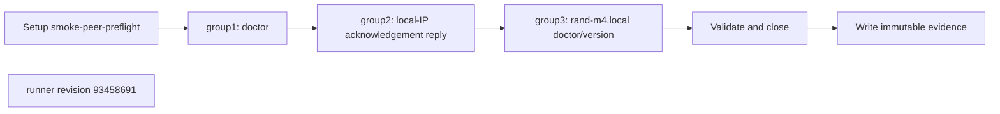

## What this test proves
This preflight lane verifies the local endpoint and each remote peer's doctor response and advertised host before any cross-host message work. A failed peer is recorded as a bounded preflight result.

## Flow

## Steps
| step | action | observable | evidence |
| --- | --- | --- | --- |
| 1 | Execute `doctor` | The named check reports PASS or FAIL at revision `7475fed9` | `smoke-peer-preflight.json` cases |
| 2 | Execute `advertised host` | The named check reports PASS or FAIL at revision `7475fed9` | `smoke-peer-preflight.json` cases |
| 3 | Execute `local-IP send/read/content` | The named check reports PASS or FAIL at revision `7475fed9` | `smoke-peer-preflight.json` cases |
| 4 | Execute `local-IP requires-ack delivery/content` | The named check reports PASS or FAIL at revision `7475fed9` | `smoke-peer-preflight.json` cases |
| 5 | Execute `local-IP acknowledgement reply delivery/content` | The named check reports PASS or FAIL at revision `7475fed9` | `smoke-peer-preflight.json` cases |
| 6 | Execute `loopback-IP send/read/content` | The named check reports PASS or FAIL at revision `7475fed9` | `smoke-peer-preflight.json` cases |
| 7 | Execute `loopback-IP requires-ack delivery/content` | The named check reports PASS or FAIL at revision `7475fed9` | `smoke-peer-preflight.json` cases |
| 8 | Execute `loopback-IP acknowledgement reply delivery/content` | The named check reports PASS or FAIL at revision `7475fed9` | `smoke-peer-preflight.json` cases |
| 9 | Execute `rand-m4.local doctor/version` | The named check reports PASS or FAIL at revision `7475fed9` | `smoke-peer-preflight.json` cases |
| 10 | Execute `rand-m4.local advertised host` | The named check reports PASS or FAIL at revision `7475fed9` | `smoke-peer-preflight.json` cases |

## Evidence layout
The runner writes immutable evidence for `smoke-peer-preflight` beneath `site/reports/`. The JSON payload is the source for case or worker outcomes; the rendered report and envelope provide the public navigation entry.

## Changes
The revision sections below are the retained runner-history backfill. Each section records the source revision and its own ordered procedure description.

## Revision 7475fed9 (2026-09-04)
The runner change `fix(smoke): configure direct-peer port` is the source for this revision's procedure order.

## Steps
| step | action | observable | evidence |
| --- | --- | --- | --- |
| 1 | Execute `doctor` | The named check reports PASS or FAIL at revision `7475fed9` | `smoke-peer-preflight.json` cases |
| 2 | Execute `advertised host` | The named check reports PASS or FAIL at revision `7475fed9` | `smoke-peer-preflight.json` cases |
| 3 | Execute `local-IP send/read/content` | The named check reports PASS or FAIL at revision `7475fed9` | `smoke-peer-preflight.json` cases |
| 4 | Execute `local-IP requires-ack delivery/content` | The named check reports PASS or FAIL at revision `7475fed9` | `smoke-peer-preflight.json` cases |
| 5 | Execute `local-IP acknowledgement reply delivery/content` | The named check reports PASS or FAIL at revision `7475fed9` | `smoke-peer-preflight.json` cases |
| 6 | Execute `loopback-IP send/read/content` | The named check reports PASS or FAIL at revision `7475fed9` | `smoke-peer-preflight.json` cases |
| 7 | Execute `loopback-IP requires-ack delivery/content` | The named check reports PASS or FAIL at revision `7475fed9` | `smoke-peer-preflight.json` cases |
| 8 | Execute `loopback-IP acknowledgement reply delivery/content` | The named check reports PASS or FAIL at revision `7475fed9` | `smoke-peer-preflight.json` cases |
| 9 | Execute `rand-m4.local doctor/version` | The named check reports PASS or FAIL at revision `7475fed9` | `smoke-peer-preflight.json` cases |
| 10 | Execute `rand-m4.local advertised host` | The named check reports PASS or FAIL at revision `7475fed9` | `smoke-peer-preflight.json` cases |

## Revision 93458691 (2026-08-20)
The runner change `test: prove mTLS rejects unauthenticated clients` is the source for this revision's procedure order.

## Steps
| step | action | observable | evidence |
| --- | --- | --- | --- |
| 1 | Execute `doctor` | The named check reports PASS or FAIL at revision `93458691` | `smoke-peer-preflight.json` cases |
| 2 | Execute `advertised host` | The named check reports PASS or FAIL at revision `93458691` | `smoke-peer-preflight.json` cases |
| 3 | Execute `local-IP send/read/content` | The named check reports PASS or FAIL at revision `93458691` | `smoke-peer-preflight.json` cases |
| 4 | Execute `local-IP requires-ack delivery/content` | The named check reports PASS or FAIL at revision `93458691` | `smoke-peer-preflight.json` cases |
| 5 | Execute `local-IP acknowledgement reply delivery/content` | The named check reports PASS or FAIL at revision `93458691` | `smoke-peer-preflight.json` cases |
| 6 | Execute `loopback-IP send/read/content` | The named check reports PASS or FAIL at revision `93458691` | `smoke-peer-preflight.json` cases |
| 7 | Execute `loopback-IP requires-ack delivery/content` | The named check reports PASS or FAIL at revision `93458691` | `smoke-peer-preflight.json` cases |
| 8 | Execute `loopback-IP acknowledgement reply delivery/content` | The named check reports PASS or FAIL at revision `93458691` | `smoke-peer-preflight.json` cases |
| 9 | Execute `rand-m4.local doctor/version` | The named check reports PASS or FAIL at revision `93458691` | `smoke-peer-preflight.json` cases |
| 10 | Execute `rand-m4.local advertised host` | The named check reports PASS or FAIL at revision `93458691` | `smoke-peer-preflight.json` cases |

## Revision 513b3374 (2026-08-07)
The runner change `fix(smoke): index every hardware smoke run` is the source for this revision's procedure order.

## Steps
| step | action | observable | evidence |
| --- | --- | --- | --- |
| 1 | Execute `doctor` | The named check reports PASS or FAIL at revision `513b3374` | `smoke-peer-preflight.json` cases |
| 2 | Execute `advertised host` | The named check reports PASS or FAIL at revision `513b3374` | `smoke-peer-preflight.json` cases |
| 3 | Execute `local-IP send/read/content` | The named check reports PASS or FAIL at revision `513b3374` | `smoke-peer-preflight.json` cases |
| 4 | Execute `local-IP requires-ack delivery/content` | The named check reports PASS or FAIL at revision `513b3374` | `smoke-peer-preflight.json` cases |
| 5 | Execute `local-IP acknowledgement reply delivery/content` | The named check reports PASS or FAIL at revision `513b3374` | `smoke-peer-preflight.json` cases |
| 6 | Execute `loopback-IP send/read/content` | The named check reports PASS or FAIL at revision `513b3374` | `smoke-peer-preflight.json` cases |
| 7 | Execute `loopback-IP requires-ack delivery/content` | The named check reports PASS or FAIL at revision `513b3374` | `smoke-peer-preflight.json` cases |
| 8 | Execute `loopback-IP acknowledgement reply delivery/content` | The named check reports PASS or FAIL at revision `513b3374` | `smoke-peer-preflight.json` cases |
| 9 | Execute `rand-m4.local doctor/version` | The named check reports PASS or FAIL at revision `513b3374` | `smoke-peer-preflight.json` cases |
| 10 | Execute `rand-m4.local advertised host` | The named check reports PASS or FAIL at revision `513b3374` | `smoke-peer-preflight.json` cases |

## Revision 8043ce64 (2026-08-07)
The runner change `fix(al9): discover same-host smoke address at runtime` is the source for this revision's procedure order.

## Steps
| step | action | observable | evidence |
| --- | --- | --- | --- |
| 1 | Execute `doctor` | The named check reports PASS or FAIL at revision `8043ce64` | `smoke-peer-preflight.json` cases |
| 2 | Execute `advertised host` | The named check reports PASS or FAIL at revision `8043ce64` | `smoke-peer-preflight.json` cases |
| 3 | Execute `local-IP send/read/content` | The named check reports PASS or FAIL at revision `8043ce64` | `smoke-peer-preflight.json` cases |
| 4 | Execute `local-IP requires-ack delivery/content` | The named check reports PASS or FAIL at revision `8043ce64` | `smoke-peer-preflight.json` cases |
| 5 | Execute `local-IP acknowledgement reply delivery/content` | The named check reports PASS or FAIL at revision `8043ce64` | `smoke-peer-preflight.json` cases |
| 6 | Execute `loopback-IP send/read/content` | The named check reports PASS or FAIL at revision `8043ce64` | `smoke-peer-preflight.json` cases |
| 7 | Execute `loopback-IP requires-ack delivery/content` | The named check reports PASS or FAIL at revision `8043ce64` | `smoke-peer-preflight.json` cases |
| 8 | Execute `loopback-IP acknowledgement reply delivery/content` | The named check reports PASS or FAIL at revision `8043ce64` | `smoke-peer-preflight.json` cases |
| 9 | Execute `rand-m4.local doctor/version` | The named check reports PASS or FAIL at revision `8043ce64` | `smoke-peer-preflight.json` cases |
| 10 | Execute `rand-m4.local advertised host` | The named check reports PASS or FAIL at revision `8043ce64` | `smoke-peer-preflight.json` cases |

## Revision c355f382 (2026-07-26)
The runner change `feat(smoke): add progressive live daemon features` is the source for this revision's procedure order.

## Steps
| step | action | observable | evidence |
| --- | --- | --- | --- |
| 1 | Execute `doctor` | The named check reports PASS or FAIL at revision `c355f382` | `smoke-peer-preflight.json` cases |
| 2 | Execute `advertised host` | The named check reports PASS or FAIL at revision `c355f382` | `smoke-peer-preflight.json` cases |
| 3 | Execute `local-IP send/read/content` | The named check reports PASS or FAIL at revision `c355f382` | `smoke-peer-preflight.json` cases |
| 4 | Execute `local-IP requires-ack delivery/content` | The named check reports PASS or FAIL at revision `c355f382` | `smoke-peer-preflight.json` cases |
| 5 | Execute `local-IP acknowledgement reply delivery/content` | The named check reports PASS or FAIL at revision `c355f382` | `smoke-peer-preflight.json` cases |
| 6 | Execute `loopback-IP send/read/content` | The named check reports PASS or FAIL at revision `c355f382` | `smoke-peer-preflight.json` cases |
| 7 | Execute `loopback-IP requires-ack delivery/content` | The named check reports PASS or FAIL at revision `c355f382` | `smoke-peer-preflight.json` cases |
| 8 | Execute `loopback-IP acknowledgement reply delivery/content` | The named check reports PASS or FAIL at revision `c355f382` | `smoke-peer-preflight.json` cases |
| 9 | Execute `rand-m4.local doctor/version` | The named check reports PASS or FAIL at revision `c355f382` | `smoke-peer-preflight.json` cases |
| 10 | Execute `rand-m4.local advertised host` | The named check reports PASS or FAIL at revision `c355f382` | `smoke-peer-preflight.json` cases |
